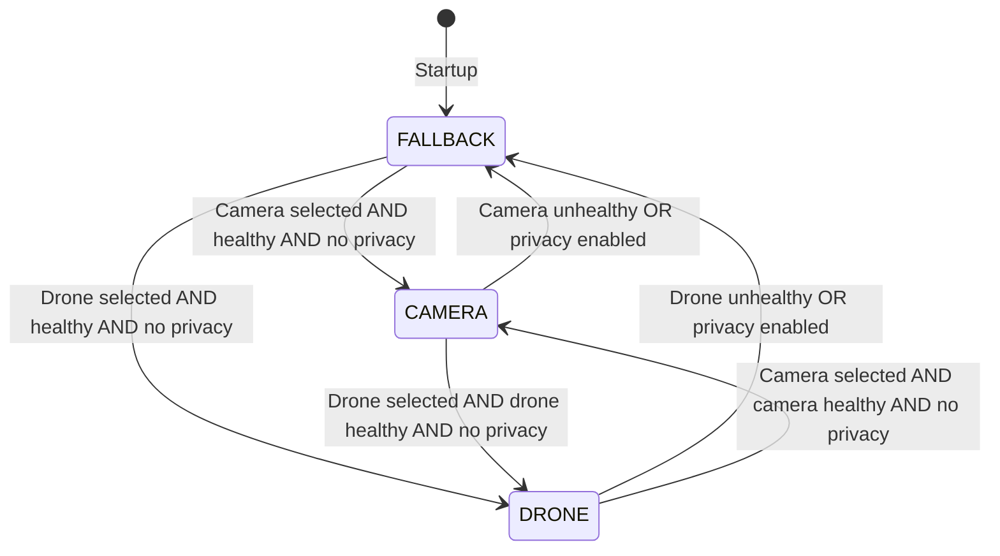

# Bidirectional CAMERA ↔ DRONE Switching Implementation Plan

## Overview

This plan details the implementation of **direct switching between CAMERA and DRONE inputs** without requiring an intermediate fallback step. This complements the existing functionality:

- **Existing:** FALLBACK ↔ CAMERA, FALLBACK ↔ DRONE  
- **New:** CAMERA ↔ DRONE (bidirectional direct switching)

## Requirements

1. **User-triggered + Automatic switching:** When user sets `g_requested_live_source` via HTTP API (POST `/input`), the system should switch to the requested source as soon as it becomes healthy
2. **No intermediate fallback:** When switching CAMERA→DRONE or DRONE→CAMERA, go directly without fallback intermediate step
3. **Safe splicing:** All switches must occur at IDR frames with proper SPS/PPS injection and timestamp rebasing

## Current State Transition Table

| From | To | Trigger |
|---------|----------|---------------------------------------------|
| FALLBACK | CAMERA | Camera ready + camera selected (default) + no privacy |
| FALLBACK | DRONE | Drone ready + drone selected + no privacy |
| CAMERA | FALLBACK | Camera lost OR privacy enabled |
| DRONE | FALLBACK | Drone lost OR privacy enabled |

## New State Transition Table

| From | To | Trigger |
|---------|----------|---------------------------------------------|
| FALLBACK | CAMERA | Camera ready + camera selected + no privacy |
| FALLBACK | DRONE | Drone ready + drone selected + no privacy |
| CAMERA | FALLBACK | Camera lost OR privacy enabled |
| CAMERA | DRONE | **Drone selected + drone ready + no privacy** |
| DRONE | FALLBACK | Drone lost OR privacy enabled |
| DRONE | CAMERA | **Camera selected + camera ready + no privacy** |

## State Diagram



## Implementation Details

### 1. Modify Mode::CAMERA Section

Add check for user wanting DRONE and DRONE being healthy:

```cpp
else if (current_mode == Mode::CAMERA) {
    // First check: privacy mode OR camera unhealthy → go to FALLBACK
    bool camera_unhealthy = !camera_reader.isConnected() || 
                            !camera_reader.isStreamReady() || 
                            !camera_reader.isHealthy();
    
    if (g_privacy_mode_enabled.load() || camera_unhealthy) {
        // ... existing fallback switch logic ...
    }
    // NEW: Check if user wants DRONE and drone is available
    else if (g_requested_live_source.load() == RequestedLiveSource::DRONE &&
             drone_reader.isConnected() && 
             drone_reader.isStreamReady() && 
             drone_reader.isHealthy()) {
        // Switch directly to drone (new logic)
        std::cout << "[Main] ========================================" << std::endl;
        std::cout << "[Main] User requested DRONE - switching from CAMERA!" << std::endl;
        std::cout << "[Main] ========================================" << std::endl;
        
        // ... splice to drone (wait for IDR, inject SPS/PPS, rebase timestamps) ...
        
        current_mode = Mode::DRONE;
        active_reader = &drone_reader;
        // Update scene to "live-drone"
    }
}
```

### 2. Modify Mode::DRONE Section

Add check for user wanting CAMERA and CAMERA being healthy:

```cpp
else if (current_mode == Mode::DRONE) {
    // First check: privacy mode OR drone unhealthy → go to FALLBACK
    bool drone_unhealthy = !drone_reader.isConnected() || 
                           !drone_reader.isStreamReady() || 
                           !drone_reader.isHealthy();
    
    if (g_privacy_mode_enabled.load() || drone_unhealthy) {
        // ... existing fallback switch logic ...
    }
    // NEW: Check if user wants CAMERA and camera is available
    else if (g_requested_live_source.load() == RequestedLiveSource::CAMERA &&
             camera_reader.isConnected() && 
             camera_reader.isStreamReady() && 
             camera_reader.isHealthy()) {
        // Switch directly to camera (new logic)
        std::cout << "[Main] ========================================" << std::endl;
        std::cout << "[Main] User requested CAMERA - switching from DRONE!" << std::endl;
        std::cout << "[Main] ========================================" << std::endl;
        
        // ... splice to camera (wait for IDR, inject SPS/PPS, rebase timestamps) ...
        
        current_mode = Mode::CAMERA;
        active_reader = &camera_reader;
        // Update scene to "live-camera"
    }
}
```

### 3. Splicing Requirements for Direct Switch

The splice operation between live sources follows the same pattern as switching to/from fallback:

1. **Wait for stream info** on target source
2. **Wait for IDR frame** on target source (clean decode point)  
3. **Wait for audio sync** to ensure A/V alignment
4. **Extract timestamp bases** (PTS, PCR) from target stream
5. **Inject SPS/PPS packets** before first IDR frame
6. **Process buffered packets** from target source (with timestamp rebasing)
7. **Update splicer offsets** for continuous timestamps
8. **Update consumption index** on target reader

### 4. Code Structure - Consider Helper Function

To reduce code duplication, consider extracting the splice logic into a helper:

```cpp
// Helper to perform safe splice to a new source
bool performSplice(FIFOInput& target_reader, 
                   StreamSplicer& splicer,
                   FIFOOutput& output,
                   uint64_t& pts_base,
                   uint64_t& pcr_base,
                   int64_t& pcr_pts_alignment,
                   const std::string& source_name);
```

However, since each switch has slightly different logging and scene names, inline implementation may be clearer.

## Testing Scenarios

| # | Scenario | Steps | Expected Result |
|---|----------|-------|-----------------|
| 1 | FALLBACK → CAMERA | Start with fallback, camera becomes available | Switches to camera at IDR frame |
| 2 | FALLBACK → DRONE | Set input to drone, drone becomes available | Switches to drone at IDR frame |
| 3 | CAMERA → FALLBACK | Disconnect camera or enable privacy | Switches to fallback at IDR frame |
| 4 | DRONE → FALLBACK | Disconnect drone or enable privacy | Switches to fallback at IDR frame |
| 5 | **CAMERA → DRONE** | While on camera, POST /input drone, both sources healthy | **Direct switch to drone at IDR** |
| 6 | **DRONE → CAMERA** | While on drone, POST /input camera, both sources healthy | **Direct switch to camera at IDR** |
| 7 | CAMERA → request DRONE but drone unhealthy | POST /input drone, drone disconnected | Stays on camera, logs waiting status |
| 8 | Privacy during direct switch | While on camera, POST /input drone, then enable privacy | Goes to fallback instead |

## API Reference

### Switch to Drone Input
```bash
curl -X POST http://multiplexer:8091/input \
  -H "Content-Type: application/json" \
  -d '{"source": "drone"}'
```

### Switch to Camera Input
```bash
curl -X POST http://multiplexer:8091/input \
  -H "Content-Type: application/json" \
  -d '{"source": "camera"}'
```

### Get Current Scene
```bash
curl http://multiplexer:8091/scene
# Response: {"scene": "fallback"} or {"scene": "live-camera"} or {"scene": "live-drone"}
```

## Files to Modify

| File | Changes |
|------|---------|
| `src/main_new.cpp` | Add CAMERA→DRONE and DRONE→CAMERA switch logic in main loop |
| `DRONE_INPUT_IMPLEMENTATION_PLAN.md` | Update state transition table |
| `ARCHITECTURE.md` | Update to reflect bidirectional switching (optional) |

## Key Implementation Notes

1. **Priority Check Order:** Always check privacy mode and source health FIRST before checking for direct source switch. This ensures:
   - Privacy mode always forces fallback
   - Unhealthy sources always trigger fallback
   - Direct switches only happen when source is stable

2. **Atomic Comparison:** Use `g_requested_live_source.load()` for thread-safe comparison

3. **Scene Notification:** Remember to call `http_server.notifySceneChange()` with correct scene name

4. **Logging:** Add clear log separator lines for visibility in container logs

## Estimated Line Changes

- **CAMERA mode block:** ~60 lines added (CAMERA→DRONE switch logic)
- **DRONE mode block:** ~60 lines added (DRONE→CAMERA switch logic)
- **Total:** ~120 lines of new code in `main_new.cpp`
