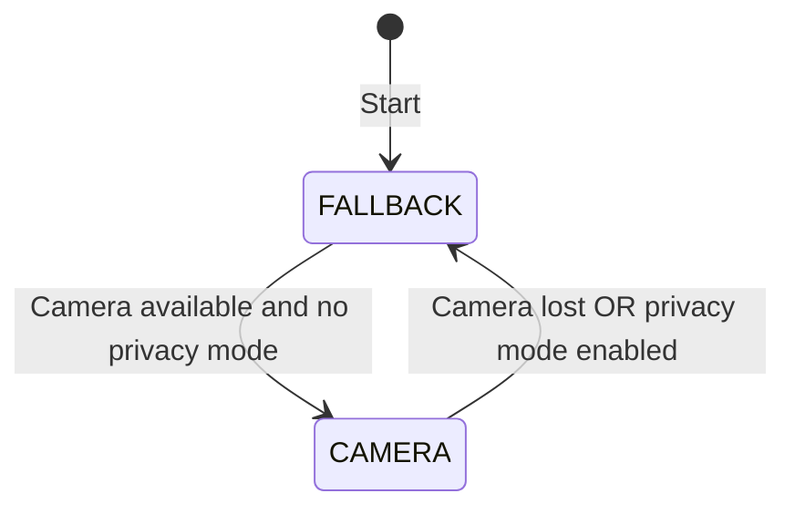
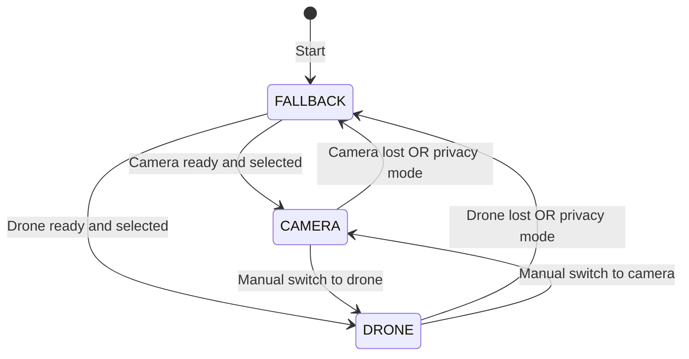
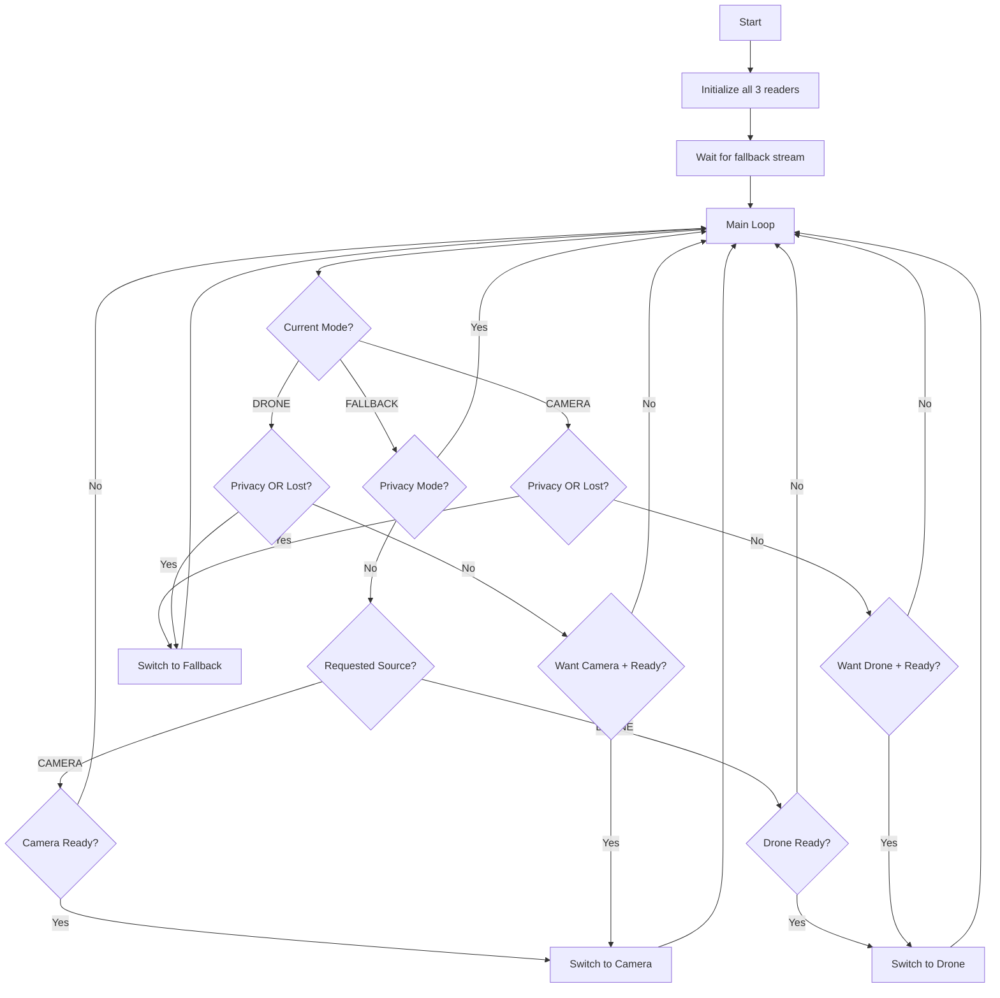

# Drone Input Implementation Plan

## Overview

This plan details the implementation of a third input source (Drone) in `main_new.cpp`, enabling switching between:
- **Camera** ↔ **Fallback**
- **Drone** ↔ **Fallback**  
- **Camera** ↔ **Drone** (manual switching)

## Current Architecture



## Target Architecture



## Implementation Steps

### 1. Add Drone Pipe Constant and FIFOInput Reader

**File: `src/main_new.cpp`**

Add the drone pipe constant alongside existing pipes:

```cpp
// Configuration
const std::string CAMERA_PIPE = "/pipe/camera.ts";
const std::string FALLBACK_PIPE = "/pipe/fallback.ts";
const std::string DRONE_PIPE = "/pipe/drone.ts";  // NEW
const std::string OUTPUT_PIPE = "/pipe/ts_output.pipe";
```

Create the drone reader:

```cpp
std::cout << "[Main] Creating FIFO readers..." << std::endl;
FIFOInput camera_reader("Camera", CAMERA_PIPE);
FIFOInput fallback_reader("Fallback", FALLBACK_PIPE);
FIFOInput drone_reader("Drone", DRONE_PIPE);  // NEW
```

### 2. Extend Mode Enum

Change the Mode enum from 2 states to 3:

```cpp
// Main loop state
enum class Mode { FALLBACK, CAMERA, DRONE };  // ADD DRONE
Mode current_mode = Mode::FALLBACK;
FIFOInput* active_reader = &fallback_reader;
```

### 3. Add Requested Input Source Tracking

Add a global atomic to track which live source the user wants:

```cpp
// Global requested input source (camera or drone) - can be changed via HTTP
enum class RequestedLiveSource { CAMERA, DRONE };
std::atomic<RequestedLiveSource> g_requested_live_source(RequestedLiveSource::CAMERA);
```

### 4. Update Scene State Values

The `g_current_scene_ptr` needs to support three scene values:
- `"fallback"` - Fallback stream active
- `"live-camera"` - Camera stream active
- `"live-drone"` - Drone stream active

Alternatively, keep it simple with `"fallback"`, `"live"` and track the actual source separately.

### 5. Switching Logic Updates

#### 5.1 From FALLBACK Mode

```cpp
if (current_mode == Mode::FALLBACK) {
    // Determine which live source to try based on user selection
    RequestedLiveSource requested = g_requested_live_source.load();
    
    if (!g_privacy_mode_enabled.load()) {
        if (requested == RequestedLiveSource::CAMERA) {
            // Try camera first
            if (camera_reader.isConnected() && camera_reader.isStreamReady()) {
                // Switch to camera (existing logic)
            }
        } else if (requested == RequestedLiveSource::DRONE) {
            // Try drone
            if (drone_reader.isConnected() && drone_reader.isStreamReady()) {
                // Switch to drone (similar to camera logic)
            }
        }
    }
}
```

#### 5.2 From CAMERA Mode

```cpp
else if (current_mode == Mode::CAMERA) {
    // Check if privacy mode OR camera lost OR user wants drone
    bool switch_to_fallback = g_privacy_mode_enabled.load() ||
                              !camera_reader.isConnected() ||
                              !camera_reader.isStreamReady();
    
    bool switch_to_drone = !g_privacy_mode_enabled.load() &&
                           g_requested_live_source.load() == RequestedLiveSource::DRONE &&
                           drone_reader.isConnected() &&
                           drone_reader.isStreamReady();
    
    if (switch_to_fallback) {
        // Switch to fallback (existing logic)
    } else if (switch_to_drone) {
        // Switch to drone (new logic)
    }
}
```

#### 5.3 From DRONE Mode 

```cpp
else if (current_mode == Mode::DRONE) {
    // Check if privacy mode OR drone lost OR user wants camera
    bool switch_to_fallback = g_privacy_mode_enabled.load() ||
                              !drone_reader.isConnected() ||
                              !drone_reader.isStreamReady();
    
    bool switch_to_camera = !g_privacy_mode_enabled.load() &&
                            g_requested_live_source.load() == RequestedLiveSource::CAMERA &&
                            camera_reader.isConnected() &&
                            camera_reader.isStreamReady();
    
    if (switch_to_fallback) {
        // Switch to fallback
    } else if (switch_to_camera) {
        // Switch to camera
    }
}
```

### 6. Start Drone Reader

Add drone reader startup:

```cpp
std::cout << "[Main] Starting FIFO readers..." << std::endl;
if (!camera_reader.start()) {
    std::cerr << "[Main] Failed to start camera reader" << std::endl;
    return 1;
}
if (!fallback_reader.start()) {
    std::cerr << "[Main] Failed to start fallback reader" << std::endl;
    return 1;
}
if (!drone_reader.start()) {  // NEW
    std::cerr << "[Main] Failed to start drone reader" << std::endl;
    return 1;
}
```

### 7. Update Statistics and Cleanup

Add drone statistics:

```cpp
std::cout << "[Main] Final statistics:" << std::endl;
std::cout << "  Packets processed: " << packets_processed << std::endl;
std::cout << "  Camera packets received: " << camera_reader.getPacketsReceived() << std::endl;
std::cout << "  Drone packets received: " << drone_reader.getPacketsReceived() << std::endl;  // NEW
std::cout << "  Fallback packets received: " << fallback_reader.getPacketsReceived() << std::endl;
std::cout << "  Output packets written: " << fifo_output.getPacketsWritten() << std::endl;
```

Add drone reader cleanup:

```cpp
// Cleanup
http_server.stop();
camera_reader.stop();
drone_reader.stop();  // NEW
fallback_reader.stop();
fifo_output.close();
```

### 8. HTTP API Updates

#### Update InputSourceManager enum

**File: `src/InputSourceManager.h`**

The enum already has CAMERA and DRONE, so no changes needed there!

```cpp
enum class InputSource {
    CAMERA,  // SRT camera input
    DRONE    // Drone RTMP input - ALREADY EXISTS!
};
```

#### Add HTTP callback for live source switching

Register a callback in main that changes `g_requested_live_source`:

```cpp
http_server.setInputSourceCallback([](InputSource source) {
    if (source == InputSource::CAMERA) {
        g_requested_live_source.store(RequestedLiveSource::CAMERA);
        std::cout << "[Main] Requested live source changed to CAMERA" << std::endl;
    } else if (source == InputSource::DRONE) {
        g_requested_live_source.store(RequestedLiveSource::DRONE);
        std::cout << "[Main] Requested live source changed to DRONE" << std::endl;
    }
});
```

### 9. Scene Notifications

Update scene change notifications to use more descriptive scene names:

```cpp
// When switching to camera
http_server.notifySceneChange("live-camera", g_controller_url);

// When switching to drone  
http_server.notifySceneChange("live-drone", g_controller_url);

// When switching to fallback
http_server.notifySceneChange("fallback", g_controller_url);
```

Update the global scene tracking accordingly.

## Key Code Changes Summary

| File | Change |
|------|--------|
| `src/main_new.cpp` | Add DRONE_PIPE, drone_reader, Mode::DRONE, switching logic |
| `src/main_new.cpp` | Add g_requested_live_source atomic |
| `src/main_new.cpp` | Update startup/cleanup for drone_reader |
| `src/main_new.cpp` | Add drone statistics |
| `src/main_new.cpp` | Register InputSourceCallback |

## Testing Checklist

- [ ] Compile successfully with no warnings
- [ ] Fallback stream starts correctly
- [ ] Camera switching works as before
- [ ] Drone switching works when drone source available
- [ ] Camera ↔ Drone manual switching via API
- [ ] Privacy mode forces fallback from both camera and drone
- [ ] Stream continuity maintained during all switches
- [ ] Statistics show correct packet counts

## Flow Diagram



## API Usage Examples

### Switch to Drone Input
```bash
curl -X POST http://multiplexer:8091/input \
  -H "Content-Type: application/json" \
  -d '{"source": "drone"}'
```

### Switch to Camera Input
```bash
curl -X POST http://multiplexer:8091/input \
  -H "Content-Type: application/json" \
  -d '{"source": "camera"}'
```

### Get Current Input Source
```bash
curl http://multiplexer:8091/input
# Response: {"source": "camera"} or {"source": "drone"}
```

### Get Current Scene
```bash
curl http://multiplexer:8091/scene
# Response: {"scene": "fallback"}, {"scene": "live-camera"}, or {"scene": "live-drone"}
```
