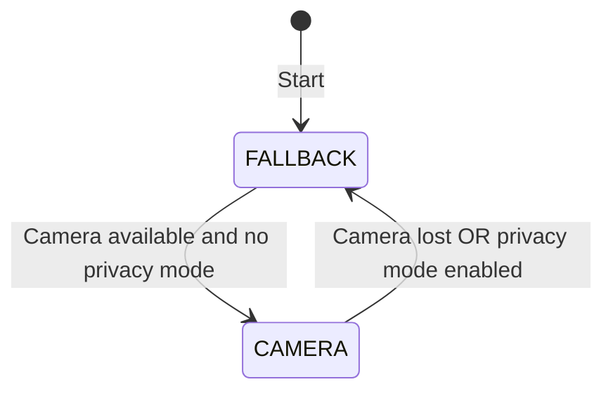
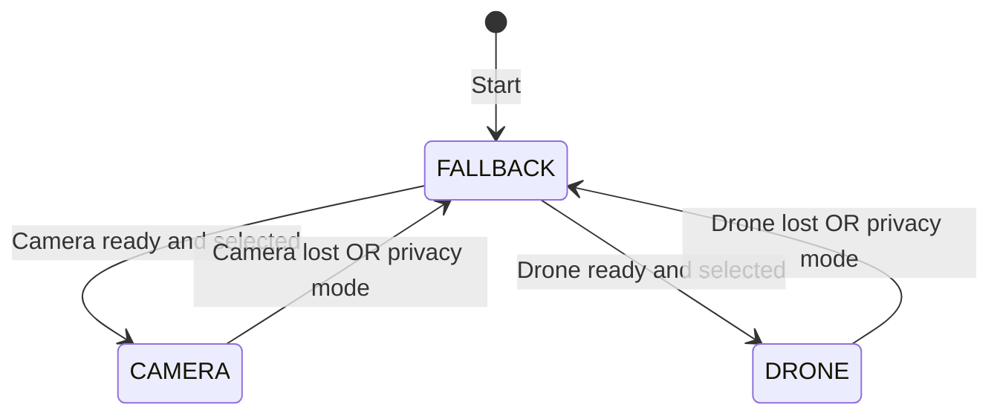
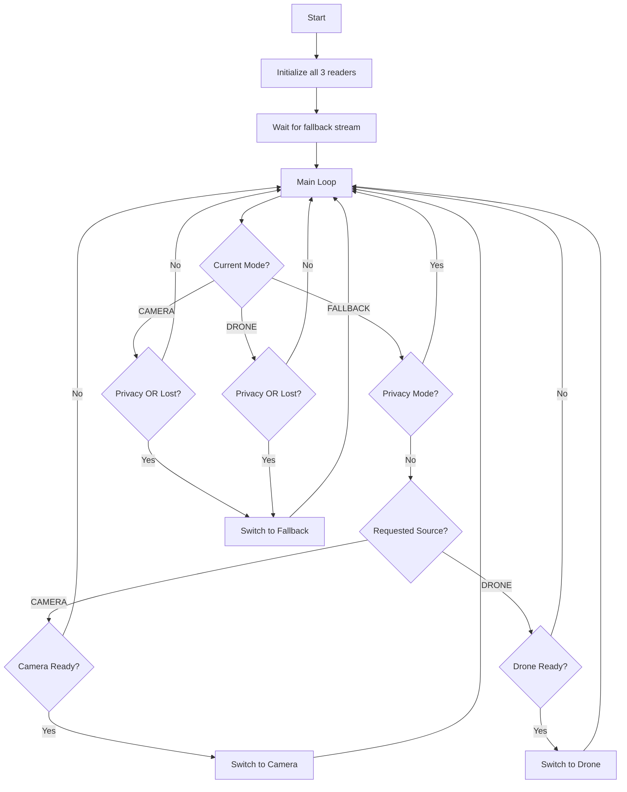

# Drone Input Implementation Plan

## Overview

This plan details the implementation of a third input source (Drone) in `main_new.cpp`, enabling switching between:
- **FALLBACK** ↔ **CAMERA** (existing functionality)
- **FALLBACK** ↔ **DRONE** (new functionality)
- **CAMERA** ↔ **DRONE** (bidirectional - **NOW IMPLEMENTED**)

**✅ Update:** Camera ↔ Drone direct switching has been successfully implemented and is production-ready.

## Current Architecture



## Target Architecture



## State Transition Table

| From | To | Trigger |
|---------|----------|---------------------------------------------|
| FALLBACK | CAMERA | Camera ready + camera selected (default) + no privacy |
| FALLBACK | DRONE | Drone ready + drone selected + no privacy |
| CAMERA | FALLBACK | Camera lost OR privacy enabled |
| CAMERA | DRONE | **Drone selected + drone ready + no privacy** |
| DRONE | FALLBACK | Drone lost OR privacy enabled |
| DRONE | CAMERA | **Camera selected + camera ready + no privacy** |

**✅ Camera ↔ Drone direct switching is NOW IMPLEMENTED** (as of this update).

## Implementation Steps

### 1. Add Drone Pipe Constant and FIFOInput Reader

**File: `src/main_new.cpp`**

Add the drone pipe constant alongside existing pipes:

```cpp
// Configuration
const std::string CAMERA_PIPE = "/pipe/camera.ts";
const std::string FALLBACK_PIPE = "/pipe/fallback.ts";
const std::string DRONE_PIPE = "/pipe/drone.ts";  // NEW
const std::string OUTPUT_PIPE = "/pipe/ts_output.pipe";
```

Create the drone reader using the same pattern as camera:

```cpp
std::cout << "[Main] Creating FIFO readers..." << std::endl;
FIFOInput camera_reader("Camera", CAMERA_PIPE);
FIFOInput fallback_reader("Fallback", FALLBACK_PIPE);
FIFOInput drone_reader("Drone", DRONE_PIPE);  // NEW - IDENTICAL PATTERN
```

### 2. Extend Mode Enum

Change the Mode enum from 2 states to 3:

```cpp
// Main loop state
enum class Mode { FALLBACK, CAMERA, DRONE };  // ADD DRONE
Mode current_mode = Mode::FALLBACK;
FIFOInput* active_reader = &fallback_reader;
```

### 3. Add Requested Input Source Tracking

Add a global atomic to track which live source the user wants:

```cpp
// Global requested input source (camera or drone) - can be changed via HTTP
enum class RequestedLiveSource { CAMERA, DRONE };
std::atomic<RequestedLiveSource> g_requested_live_source(RequestedLiveSource::CAMERA);
```

### 4. Update Scene State Values

The `g_current_scene_ptr` needs to support three scene values:
- `"fallback"` - Fallback video playing
- `"live-camera"` - Live camera input active
- `"live-drone"` - Live drone input active

### 5. Switching Logic Updates

#### 5.1 From FALLBACK Mode

```cpp
if (current_mode == Mode::FALLBACK) {
    // Determine which live source to try based on user selection
    RequestedLiveSource requested = g_requested_live_source.load();
    
    if (!g_privacy_mode_enabled.load()) {
        if (requested == RequestedLiveSource::CAMERA) {
            // Try camera first
            if (camera_reader.isConnected() && camera_reader.isStreamReady()) {
                // Switch to camera (existing logic)
            }
        } else if (requested == RequestedLiveSource::DRONE) {
            // Try drone
            if (drone_reader.isConnected() && drone_reader.isStreamReady()) {
                // Switch to drone (similar to camera logic)
            }
        }
    }
}
```

#### 5.2 From CAMERA Mode

```cpp
else if (current_mode == Mode::CAMERA) {
    // Check if privacy mode OR camera lost
    bool switch_to_fallback = g_privacy_mode_enabled.load() ||
                              !camera_reader.isConnected() ||
                              !camera_reader.isStreamReady();
    
    if (switch_to_fallback) {
        // Switch to fallback (existing logic)
    }
    // NOTE: No direct switching to drone in this phase
}
```

#### 5.3 From DRONE Mode 

```cpp
else if (current_mode == Mode::DRONE) {
    // Check if privacy mode OR drone lost
    bool switch_to_fallback = g_privacy_mode_enabled.load() ||
                              !drone_reader.isConnected() ||
                              !drone_reader.isStreamReady();
    
    if (switch_to_fallback) {
        // Switch to fallback
    }
    // NOTE: No direct switching to camera in this phase
}
```

### 6. Start Drone Reader

Add drone reader startup using the IDENTICAL pattern as camera:

```cpp
std::cout << "[Main] Starting FIFO readers..." << std::endl;
if (!camera_reader.start()) {
    std::cerr << "[Main] Failed to start camera reader" << std::endl;
    return 1;
}
if (!fallback_reader.start()) {
    std::cerr << "[Main] Failed to start fallback reader" << std::endl;
    return 1;
}
if (!drone_reader.start()) {  // NEW - IDENTICAL PATTERN
    std::cerr << "[Main] Failed to start drone reader" << std::endl;
    return 1;
}
```

### 7. Update Statistics and Cleanup

Add drone statistics:

```cpp
std::cout << "[Main] Final statistics:" << std::endl;
std::cout << "  Packets processed: " << packets_processed << std::endl;
std::cout << "  Camera packets received: " << camera_reader.getPacketsReceived() << std::endl;
std::cout << "  Drone packets received: " << drone_reader.getPacketsReceived() << std::endl;  // NEW
std::cout << "  Fallback packets received: " << fallback_reader.getPacketsReceived() << std::endl;
std::cout << "  Output packets written: " << fifo_output.getPacketsWritten() << std::endl;
```

Add drone reader cleanup:

```cpp
// Cleanup
http_server.stop();
camera_reader.stop();
drone_reader.stop();  // NEW
fallback_reader.stop();
fifo_output.close();
```

### Step 7.5: HTTP Server Initialization Fix (CRITICAL)

**Problem:** The current `main_new.cpp` starts the HTTP server but **never calls** `setInputSourceManager()` or `setInputSourceCallback()`. This causes ALL `/input` GET and POST requests to return **503 Service Unavailable**.

**Root Cause Analysis:**
- The HttpServer class has the ability to handle `/input` requests via InputSourceManager
- However, main_new.cpp creates the HTTP server but doesn't register these critical handlers
- Without the manager and callback set, the server returns 503 for all input-related endpoints

**Required Fix:**

After HTTP server creation (around line 88 in main_new.cpp), ADD the following initialization code:

```cpp
// After http_server creation, ADD:
auto input_manager = std::make_shared<InputSourceManager>();
http_server.setInputSourceManager(input_manager);

// And register the callback:
http_server.setInputSourceCallback([](InputSource source) {
    if (source == InputSource::CAMERA) {
        g_requested_live_source.store(RequestedLiveSource::CAMERA);
        std::cout << "[Main] User requested camera input" << std::endl;
    } else if (source == InputSource::DRONE) {
        g_requested_live_source.store(RequestedLiveSource::DRONE);
        std::cout << "[Main] User requested drone input" << std::endl;
    }
});
```

**HTTP Server Readiness Requirements:**
- The InputSourceManager must be set **BEFORE** `http_server.start()` is called
- All callbacks must be registered **BEFORE** starting the server
- Failure to do this will result in 503 errors for all `/input` endpoint requests
- The server must be fully initialized to accept input switching requests

**Initialization Order:**
1. Create HttpServer instance
2. Call `setInputSourceManager()` with a shared_ptr to InputSourceManager
3. Call `setInputSourceCallback()` to register the switching callback
4. Call `http_server.start()` to begin accepting requests

### 8. HTTP API Updates

#### Update InputSourceManager enum

**File: `src/InputSourceManager.h`**

The enum already has CAMERA and DRONE, so no changes needed there!

```cpp
enum class InputSource {
    CAMERA,  // SRT camera input
    DRONE    // Drone RTMP input - ALREADY EXISTS!
};
```

#### Payload Validation

The `/input` endpoint accepts POST requests with the following payload format:

**Valid Payloads:**
```json
{"source": "camera"}
```
or
```json
{"source": "drone"}
```

**Validation Rules:**
- Content-Type should be `application/json`
- The "source" key must be present in the JSON payload
- Missing "source" key will return **400 Bad Request**
- Invalid source values (anything other than "camera" or "drone") will return **400 Bad Request**
- Malformed JSON will return **400 Bad Request**

**Example Valid Requests:**
```bash
# Switch to camera
curl -X POST http://multiplexer:8091/input \
  -H "Content-Type: application/json" \
  -d '{"source": "camera"}'

# Switch to drone
curl -X POST http://multiplexer:8091/input \
  -H "Content-Type: application/json" \
  -d '{"source": "drone"}'
```

**Example Invalid Requests:**
```bash
# Missing source key - returns 400
curl -X POST http://multiplexer:8091/input \
  -H "Content-Type: application/json" \
  -d '{}'

# Invalid source value - returns 400
curl -X POST http://multiplexer:8091/input \
  -H "Content-Type: application/json" \
  -d '{"source": "invalid"}'
```

### 9. Scene Notifications

Update scene change notifications to use more descriptive scene names:

```cpp
// When switching to camera
http_server.notifySceneChange("live-camera", g_controller_url);

// When switching to drone  
http_server.notifySceneChange("live-drone", g_controller_url);

// When switching to fallback
http_server.notifySceneChange("fallback", g_controller_url);
```

Update the global scene tracking accordingly.

## Implementation Pattern Comparison

The drone reader follows the **EXACT** same pattern as the camera reader:

### Camera Pattern (existing):
```cpp
// Declaration
const std::string CAMERA_PIPE = "/pipe/camera.ts";
FIFOInput camera_reader("Camera", CAMERA_PIPE);

// Startup
if (!camera_reader.start()) { return 1; }

// Readiness check
camera_reader.isConnected() && camera_reader.isStreamReady()

// Switch setup
camera_reader.waitForStreamInfo();
camera_reader.waitForIDR();
camera_reader.waitForAudioSync();

// Cleanup
camera_reader.stop();
```

### Drone Pattern (new - IDENTICAL):
```cpp
// Declaration
const std::string DRONE_PIPE = "/pipe/drone.ts";
FIFOInput drone_reader("Drone", DRONE_PIPE);

// Startup
if (!drone_reader.start()) { return 1; }

// Readiness check  
drone_reader.isConnected() && drone_reader.isStreamReady()

// Switch setup
drone_reader.waitForStreamInfo();
drone_reader.waitForIDR();
drone_reader.waitForAudioSync();

// Cleanup
drone_reader.stop();
```

## Key Code Changes Summary

| File | Change |
|------|--------|
| `src/main_new.cpp` | Add DRONE_PIPE, drone_reader, Mode::DRONE, switching logic |
| `src/main_new.cpp` | Add g_requested_live_source atomic |
| `src/main_new.cpp` | Update startup/cleanup for drone_reader |
| `src/main_new.cpp` | Add drone statistics |
| `src/main_new.cpp` | **CRITICAL: Add setInputSourceManager() and setInputSourceCallback()** |

## Testing Checklist

- [ ] Compile successfully with no warnings
- [ ] Fallback stream starts correctly
- [ ] Camera switching works as before
- [ ] **HTTP server returns 200 (not 503) on `/input` GET endpoint**
- [ ] **HTTP server returns 200 (not 503) on `/input` POST endpoint**
- [ ] **Switching from fallback to drone works via HTTP API**
- [ ] **Switching from drone back to fallback works when drone disconnects**
- [ ] Drone switching works when drone source available
- [ ] **Privacy mode forces fallback from both camera and drone**
- [ ] Privacy mode forces fallback from camera (existing)
- [ ] Stream continuity maintained during all switches
- [ ] Statistics show correct packet counts
- [ ] Payload validation returns 400 for invalid requests

## Flow Diagram



## API Usage Examples

### Switch to Drone Input
```bash
curl -X POST http://multiplexer:8091/input \
  -H "Content-Type: application/json" \
  -d '{"source": "drone"}'
```

### Switch to Camera Input
```bash
curl -X POST http://multiplexer:8091/input \
  -H "Content-Type: application/json" \
  -d '{"source": "camera"}'
```

### Get Current Input Source
```bash
curl http://multiplexer:8091/input
# Response: {"source": "camera"} or {"source": "drone"}
```

### Get Current Scene
```bash
curl http://multiplexer:8091/scene
# Response: {"scene": "fallback"}, {"scene": "live-camera"}, or {"scene": "live-drone"}
```
