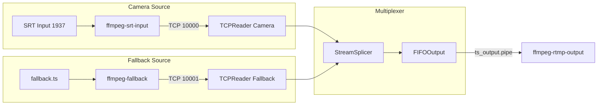
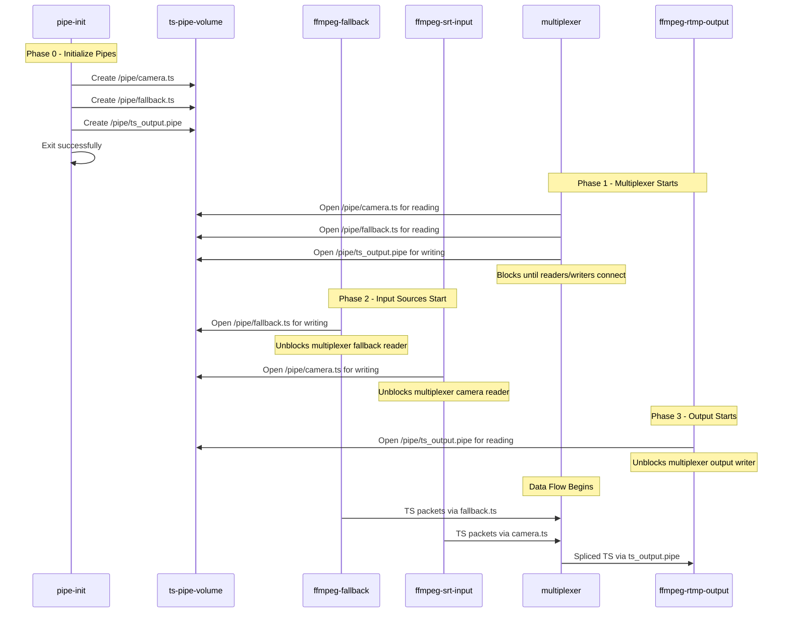

# Input Named Pipe Migration Plan

## Overview

Migrate ffmpeg-fallback and ffmpeg-srt-input from TCP output to named pipe output, allowing the multiplexer to read from named pipes instead of TCP connections. This eliminates TCP packet loss issues experienced with the current implementation.

## Current Architecture (TCP-based Input)



**Problems with TCP:**
- TCP buffer overflow causes packet loss during bitrate bursts
- Connection overhead with handshakes and reconnection logic
- Network stack overhead for container-to-container IPC
- Timing issues from TCP flow control

## Proposed Architecture (Named Pipe Input)

```mermaid
flowchart LR
    subgraph Init Container
        INIT[pipe-init] -->|creates| PIPES[/pipe/camera.ts<br>/pipe/fallback.ts<br>/pipe/ts_output.pipe]
    end
    
    subgraph Camera Source
        SRT[SRT Input 1937] --> FFMPEG_SRT[ffmpeg-srt-input]
        FFMPEG_SRT -->|writes to| PIPE_CAM[/pipe/camera.ts]
    end
    
    subgraph Fallback Source  
        VIDEO[fallback.ts] --> FFMPEG_FB[ffmpeg-fallback]
        FFMPEG_FB -->|writes to| PIPE_FB[/pipe/fallback.ts]
    end
    
    subgraph Multiplexer
        PIPE_CAM -->|FIFOInput| READER_CAM[Camera Reader]
        PIPE_FB -->|FIFOInput| READER_FB[Fallback Reader]
        READER_CAM --> SPLICER[StreamSplicer]
        READER_FB --> SPLICER
        SPLICER --> FIFO_OUT[FIFOOutput]
    end
    
    FIFO_OUT -->|ts_output.pipe| FFMPEG_OUT[ffmpeg-rtmp-output]
```

**Benefits of Named Pipes:**
- Zero packet loss with blocking writes
- Simpler design without network stack
- Direct kernel-buffered IPC
- Guaranteed byte ordering with FIFO semantics

## Named Pipe Locations

| Pipe | Location | Writer | Reader |
|------|----------|--------|--------|
| Camera input | `/pipe/camera.ts` | ffmpeg-srt-input | multiplexer |
| Fallback input | `/pipe/fallback.ts` | ffmpeg-fallback | multiplexer |
| Output | `/pipe/ts_output.pipe` | multiplexer | ffmpeg-rtmp-output |

## Startup Sequence



## Files to Create

### 1. `docker/Dockerfile.pipe-init`

Simple Alpine container that creates named pipes:

```dockerfile
FROM alpine:3.18
RUN apk add --no-cache coreutils
COPY docker/pipe-init.sh /pipe-init.sh
RUN chmod +x /pipe-init.sh
ENTRYPOINT ["/pipe-init.sh"]
```

### 2. `docker/pipe-init.sh`

Script to create all named pipes:

```bash
#!/bin/sh
set -e

PIPE_DIR="/pipe"
echo "=== Named Pipe Initialization ==="

# Create pipe directory
mkdir -p "$PIPE_DIR"

# Remove stale pipes from previous runs
rm -f "$PIPE_DIR/camera.ts" "$PIPE_DIR/fallback.ts" "$PIPE_DIR/ts_output.pipe"

# Create named pipes
mkfifo "$PIPE_DIR/camera.ts"
mkfifo "$PIPE_DIR/fallback.ts"  
mkfifo "$PIPE_DIR/ts_output.pipe"

# Set permissions
chmod 666 "$PIPE_DIR/camera.ts"
chmod 666 "$PIPE_DIR/fallback.ts"
chmod 666 "$PIPE_DIR/ts_output.pipe"

echo "Created pipes:"
ls -la "$PIPE_DIR"

echo "Pipe initialization complete"
```

### 3. `src/FIFOInput.h`

Header for named pipe reader class:

```cpp
#ifndef FIFO_INPUT_H
#define FIFO_INPUT_H

#include <string>
#include <vector>
#include <thread>
#include <mutex>
#include <condition_variable>
#include <atomic>
#include <tsduck.h>

struct StreamInfo {
    ts::PID video_pid = ts::PID_NULL;
    ts::PID audio_pid = ts::PID_NULL;
    ts::PID pcr_pid = ts::PID_NULL;
    ts::PID pmt_pid = ts::PID_NULL;
    uint16_t program_number = 0;
    uint8_t video_stream_type = 0;
    uint8_t audio_stream_type = 0;
    bool initialized = false;
};

/**
 * FIFOInput - Named pipe reader for MPEG-TS streams
 * 
 * Reads TS packets from a named pipe with the same interface
 * as TCPReader for easy migration.
 */
class FIFOInput {
public:
    FIFOInput(const std::string& name, const std::string& pipe_path);
    ~FIFOInput();
    
    bool start();
    void stop();
    
    void waitForStreamInfo();
    void waitForIDR();
    void waitForAudioSync();
    void resetForNewLoop();
    
    StreamInfo getStreamInfo() const;
    bool extractTimestampBases();
    
    std::vector<ts::TSPacket> getBufferedPacketsFromIDR();
    std::vector<ts::TSPacket> getBufferedPacketsFromAudioSync();
    std::vector<ts::TSPacket> receivePackets(size_t maxPackets, int timeoutMs);
    
    void initConsumptionFromIndex(size_t index);
    void initConsumptionFromCurrentPosition();
    size_t getLastSnapshotEnd() const;
    
    uint64_t getPTSBase() const;
    uint64_t getAudioPTSBase() const;
    uint64_t getPCRBase() const;
    int64_t getPCRPTSAlignmentOffset() const;
    
    std::vector<uint8_t> getSPSData() const;
    std::vector<uint8_t> getPPSData() const;
    
    bool isConnected() const;
    bool isStreamReady() const;
    uint64_t getPacketsReceived() const;
    
private:
    bool openPipe();
    void closePipe();
    void backgroundThreadFunc();
    void processFIFOStream();
    
    std::string name_;
    std::string pipe_path_;
    int fd_;
    
    // Same threading/buffer structure as TCPReader
    std::thread bg_thread_;
    std::atomic<bool> stop_thread_;
    std::atomic<bool> running_;
    std::atomic<bool> connected_;
    
    // Stream discovery and buffering
    // ... (same as TCPReader)
    
    static constexpr int PIPE_BUFFER_SIZE = 1 * 1024 * 1024;  // 1MB
    static constexpr size_t MAX_BUFFER_PACKETS = 1500;
};

#endif
```

### 4. `src/FIFOInput.cpp`

Implementation - similar to TCPReader but reads from FIFO instead of socket.

Key differences from TCPReader:
- Uses `open()` instead of `socket()`/`connect()`
- Uses `read()` instead of `recv()`
- Sets pipe buffer size with `fcntl(F_SETPIPE_SZ)`
- No hostname resolution needed
- Re-opens pipe on EOF (writer disconnected)

## Files to Modify

### 1. `docker-compose.yml`

Add pipe-init service and mount volume to input containers:

```yaml
services:
  # New init container - runs first and exits
  pipe-init:
    build:
      context: .
      dockerfile: docker/Dockerfile.pipe-init
    container_name: pipe-init
    volumes:
      - ts-pipe-volume:/pipe
    restart: "no"  # Run once and exit

  # Modified - add depends_on and volume mount
  ffmpeg-srt-input:
    depends_on:
      pipe-init:
        condition: service_completed_successfully
    volumes:
      - ts-pipe-volume:/pipe  # NEW
    # ... rest unchanged
    
  # Modified - add depends_on and volume mount  
  ffmpeg-fallback:
    depends_on:
      pipe-init:
        condition: service_completed_successfully
    volumes:
      - ts-pipe-volume:/pipe  # NEW
      - ${SHARED_FOLDER}:/media:rw  # existing
    # ... rest unchanged
    
  # Modified - add depends_on
  multiplexer:
    depends_on:
      pipe-init:
        condition: service_completed_successfully
      nginx-rtmp:
        condition: service_healthy
      controller:
        condition: service_healthy
    # ... rest unchanged (already has ts-pipe-volume mount)
```

### 2. `docker/ffmpeg-fallback-wrapper.sh`

Change output from TCP to named pipe:

```bash
# Before:
#   "tcp://0.0.0.0:10001?listen=1&send_buffer_size=${TCP_SEND_BUFFER_SIZE}"

# After:
PIPE_PATH="/pipe/fallback.ts"

# Wait for pipe to exist
echo "[Wrapper] Waiting for named pipe at $PIPE_PATH..."
WAIT_COUNT=0
while [ ! -p "$PIPE_PATH" ]; do
    if [ $WAIT_COUNT -ge 60 ]; then
        echo "[Wrapper] ERROR: Named pipe not created after 60 seconds"
        exit 1
    fi
    sleep 1
    WAIT_COUNT=$((WAIT_COUNT+1))
done
echo "[Wrapper] Named pipe ready!"

# FFmpeg writes to pipe
ffmpeg -nostdin \
    -loglevel info \
    -stats \
    -re \
    -stream_loop -1 \
    -fflags +genpts+nobuffer \
    -i "$FALLBACK_FILE" \
    -c copy \
    -f mpegts \
    -mpegts_flags +resend_headers \
    "${PIPE_PATH}"
```

### 3. `docker/ffmpeg-srt-input-wrapper.sh`

Change output from TCP to named pipe:

```bash
# Before:
#   "tcp://0.0.0.0:10000?listen=1&send_buffer_size=${TCP_SEND_BUFFER_SIZE}"

# After:
PIPE_PATH="/pipe/camera.ts"

# Wait for pipe to exist
echo "[Wrapper] Waiting for named pipe at $PIPE_PATH..."
while [ ! -p "$PIPE_PATH" ]; do
    sleep 1
done
echo "[Wrapper] Named pipe ready!"

# FFmpeg writes to pipe
ffmpeg -nostdin \
    -loglevel info \
    -fflags +nobuffer \
    -i "srt://0.0.0.0:1937?mode=listener&latency=${SRT_LATENCY_US}&transtype=live&payload_size=1316" \
    -c copy \
    -f mpegts \
    -mpegts_flags +resend_headers \
    "${PIPE_PATH}"
```

### 4. `docker/entrypoint.sh`

Remove pipe creation code - now handled by pipe-init container:

```bash
# Remove Phase 3: Setting Up Named Pipe section
# The pipe-init container now handles all pipe creation

echo "=== Phase 3: Starting Multiplexer ==="
# ...rest unchanged
```

### 5. `src/main_new.cpp`

Replace TCPReader with FIFOInput:

```cpp
// Before:
#include "TCPReader.h"
const std::string CAMERA_HOST = "ffmpeg-srt-input";
const uint16_t CAMERA_PORT = 10000;
const std::string FALLBACK_HOST = "ffmpeg-fallback";
const uint16_t FALLBACK_PORT = 10001;
TCPReader camera_reader("Camera", CAMERA_HOST, CAMERA_PORT);
TCPReader fallback_reader("Fallback", FALLBACK_HOST, FALLBACK_PORT);

// After:
#include "FIFOInput.h"
const std::string CAMERA_PIPE = "/pipe/camera.ts";
const std::string FALLBACK_PIPE = "/pipe/fallback.ts";
FIFOInput camera_reader("Camera", CAMERA_PIPE);
FIFOInput fallback_reader("Fallback", FALLBACK_PIPE);
```

### 6. `CMakeLists.txt`

Add FIFOInput source file:

```cmake
# Add FIFOInput.cpp to the source list
set(SOURCES
    src/main_new.cpp
    src/TCPReader.cpp      # Keep for reference or remove
    src/FIFOInput.cpp      # NEW
    src/FIFOOutput.cpp
    src/StreamSplicer.cpp
    src/HttpServer.cpp
    src/NALParser.cpp
)
```

## Testing Strategy

1. **Unit Test**: Verify FIFOInput can read TS packets from a pipe
2. **Integration Test**: Run with docker-compose and verify:
   - pipe-init creates all pipes
   - ffmpeg-fallback writes to fallback.ts
   - ffmpeg-srt-input writes to camera.ts  
   - multiplexer reads from both and outputs to ts_output.pipe
   - ffmpeg-rtmp-output receives the spliced stream
3. **Load Test**: Verify no packet loss under high bitrate
4. **Failover Test**: Verify camera→fallback switching still works

## Rollback Plan

If issues arise:
1. Remove pipe-init service dependency
2. Remove ts-pipe-volume from ffmpeg-fallback and ffmpeg-srt-input
3. Revert wrapper scripts to TCP output
4. Revert main_new.cpp to use TCPReader
5. All changes are isolated and easily reversible

## Migration Checklist

- [ ] Create docker/Dockerfile.pipe-init
- [ ] Create docker/pipe-init.sh
- [ ] Create src/FIFOInput.h
- [ ] Create src/FIFOInput.cpp
- [ ] Modify docker-compose.yml (add pipe-init, update volumes)
- [ ] Modify docker/ffmpeg-fallback-wrapper.sh
- [ ] Modify docker/ffmpeg-srt-input-wrapper.sh
- [ ] Modify docker/entrypoint.sh (remove pipe creation)
- [ ] Modify src/main_new.cpp
- [ ] Modify CMakeLists.txt
- [ ] Test with docker-compose up
- [ ] Update NAMED_PIPE_MIGRATION.md
