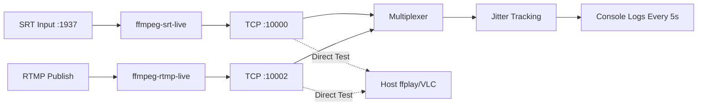

# Jitter Debug Implementation Summary

## Changes Made

### 1. Port Exposure for Direct Testing

**File: [`docker-compose.yml`](docker-compose.yml)**

Added TCP port mappings to allow direct host access to stream sources:
- **ffmpeg-srt-live**: Exposed port `10000/tcp` → Host can connect to `localhost:10000`
- **ffmpeg-rtmp-live**: Exposed port `10002/tcp` → Host can connect to `localhost:10002`

This allows testing streams directly from the host without going through the multiplexer.

### 2. Comprehensive Jitter Detection

**Files Modified:**
- [`src/TCPReceiver.h`](src/TCPReceiver.h) - Added `JitterStats` struct and tracking members
- [`src/TCPReceiver.cpp`](src/TCPReceiver.cpp) - Implemented jitter tracking and statistics calculation
- [`src/Multiplexer.cpp`](src/Multiplexer.cpp) - Added periodic jitter logging

**Metrics Tracked (per source):**

1. **Packet Arrival Timing** (Wall-clock jitter)
   - Average inter-packet interval
   - Jitter (standard deviation)
   - Min/max intervals
   
2. **PTS Delta Analysis** (Presentation timestamp spacing)
   - Average PTS delta between packets
   - PTS jitter (timestamp variance)
   - Total packets with PTS

3. **PCR Analysis** (Program Clock Reference timing)
   - Average PCR delta
   - PCR jitter
   - Total packets with PCR

4. **Buffer Statistics**
   - Current/max buffer size
   - Min/max/average buffer fill
   
5. **IDR Frame Timing** (Keyframe intervals)
   - Average IDR interval
   - IDR interval jitter
   - Total IDR frames detected

6. **Overall Stats**
   - Total packets received
   - Connection uptime

## Testing Instructions

### Test 1: Rebuild and Start Services

```bash
# Rebuild the multiplexer with new jitter tracking
docker-compose build multiplexer

# Start all services
docker-compose up -d

# Watch multiplexer logs for jitter stats (logged every 5 seconds)
docker-compose logs -f multiplexer
```

### Test 2: Direct Stream Testing from Host

Test the camera stream (SRT → TCP):
```bash
# Using ffplay
ffplay tcp://localhost:10000

# Using VLC
vlc tcp://localhost:10000

# Using ffprobe to check stream info
ffprobe tcp://localhost:10000
```

Test the drone stream (RTMP → TCP):
```bash
# Using ffplay
ffplay tcp://localhost:10002

# Using VLC
vlc tcp://localhost:10002

# Using ffprobe
ffprobe tcp://localhost:10002
```

### Test 3: Send Test Stream to SRT Input

```bash
# Send a test video to the SRT input
ffmpeg -re -i test_video.mp4 \
  -c copy \
  -f mpegts \
  "srt://localhost:1937?mode=caller"
```

## Expected Jitter Stats Output

Every 5 seconds, you'll see output like:

```
[Jitter Stats] ========================================
[Jitter] Camera:
  Packet Arrival: avg=0.53ms, jitter=0.12ms, range=[0.41-0.89ms]
  PTS: avg_delta=33.37ms, jitter=0.05ms, count=98
  PCR: avg_delta=33.33ms, jitter=0.03ms, count=87
  Buffer: current=245/1500, avg=234.50, range=[210-267]
  IDR: avg_interval=2001.23ms, jitter=3.45ms, count=12
  Total: 12458 packets, uptime=62s
[Jitter] Drone: Not connected
[Jitter] Fallback:
  Packet Arrival: avg=0.53ms, jitter=0.02ms, range=[0.51-0.56ms]
  PTS: avg_delta=33.33ms, jitter=0.01ms, count=125
  PCR: avg_delta=33.33ms, jitter=0.01ms, count=125
  Buffer: current=428/1500, avg=425.30, range=[420-435]
  IDR: avg_interval=2000.01ms, jitter=0.15ms, count=31
  Total: 15632 packets, uptime=78s
[Jitter Stats] ========================================
```

## Interpreting Results

### Identifying Source of Lag/Jitter

Compare jitter metrics across sources:

**Scenario 1: High jitter on sources, low on fallback**
```
Camera: packet_jitter=5.2ms, pts_jitter=3.1ms
Fallback: packet_jitter=0.1ms, pts_jitter=0.01ms
```
→ **Problem is upstream** (encoder/network before multiplexer)

**Scenario 2: Similar jitter across all sources**
```
Camera: packet_jitter=2.1ms, pts_jitter=1.8ms
Fallback: packet_jitter=2.3ms, pts_jitter=1.9ms
```
→ **Problem is in multiplexer** or downstream RTMP output

**Scenario 3: Buffer fluctuations**
```
Buffer: current=89/1500, avg=234.50, range=[45-892]
```
→ **Network congestion** or buffering issues

**Scenario 4: Irregular IDR intervals**
```
IDR: avg_interval=2001ms, jitter=245ms
```
→ **Encoder GOP issues** or dropped frames

### Key Metrics to Watch

| Metric | Good | Concerning |
|--------|------|------------|
| Packet jitter | < 1ms | > 5ms |
| PTS jitter | < 1ms | > 2ms |
| PCR jitter | < 0.5ms | > 2ms |
| Buffer variance | < 20% | > 50% |
| IDR jitter | < 50ms | > 200ms |

## Architecture



## Files Modified Summary

1. **[`docker-compose.yml`](docker-compose.yml:203)** - Added port `10000:10000/tcp` to ffmpeg-srt-live
2. **[`docker-compose.yml`](docker-compose.yml:231)** - Added port `10002:10002/tcp` to ffmpeg-rtmp-live  
3. **[`src/TCPReceiver.h`](src/TCPReceiver.h:14)** - Added `JitterStats` struct (42 lines)
4. **[`src/TCPReceiver.h`](src/TCPReceiver.h:112)** - Added `getJitterStats()` method
5. **[`src/TCPReceiver.h`](src/TCPReceiver.h:165)** - Added jitter tracking members
6. **[`src/TCPReceiver.cpp`](src/TCPReceiver.cpp:209)** - Initialize jitter tracking on connection
7. **[`src/TCPReceiver.cpp`](src/TCPReceiver.cpp:308)** - Track packet arrival timing
8. **[`src/TCPReceiver.cpp`](src/TCPReceiver.cpp:326)** - Track PTS deltas
9. **[`src/TCPReceiver.cpp`](src/TCPReceiver.cpp:348)** - Track PCR deltas
10. **[`src/TCPReceiver.cpp`](src/TCPReceiver.cpp:417)** - Track IDR intervals
11. **[`src/TCPReceiver.cpp`](src/TCPReceiver.cpp:475)** - Track buffer fills
12. **[`src/TCPReceiver.cpp`](src/TCPReceiver.cpp:806)** - Implemented `getJitterStats()` and helpers
13. **[`src/Multiplexer.cpp`](src/Multiplexer.cpp:2)** - Added `<iomanip>` include
14. **[`src/Multiplexer.cpp`](src/Multiplexer.cpp:465)** - Added jitter logging timer
15. **[`src/Multiplexer.cpp`](src/Multiplexer.cpp:619)** - Periodic jitter statistics output

## Troubleshooting

**If jitter stats don't appear:**
1. Ensure streams are connected and receiving data
2. Check that at least 5 seconds have passed since startup
3. Verify build was successful: `docker-compose logs multiplexer | grep -i jitter`

**If ports aren't accessible:**
1. Restart services: `docker-compose restart ffmpeg-srt-live ffmpeg-rtmp-live`
2. Check port bindings: `docker ps | grep ffmpeg`
3. Verify no other services using ports 10000/10002

**If statistics show zero:**
- Ensure streams are actively sending data
- Check that PIDs have been discovered (wait for stream initialization)