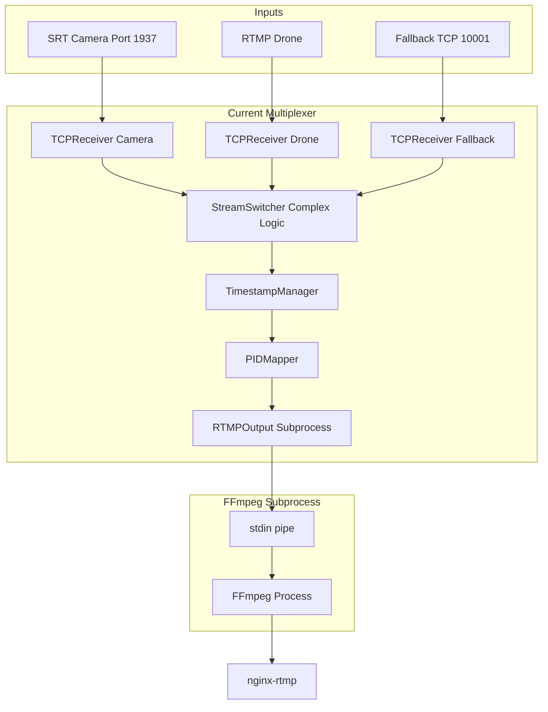
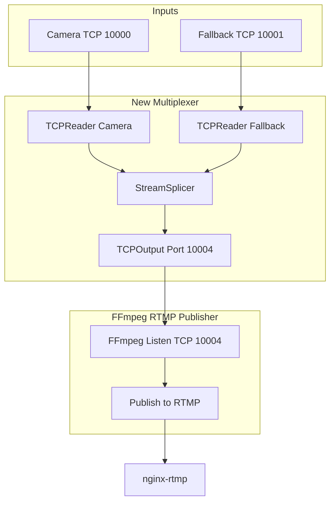
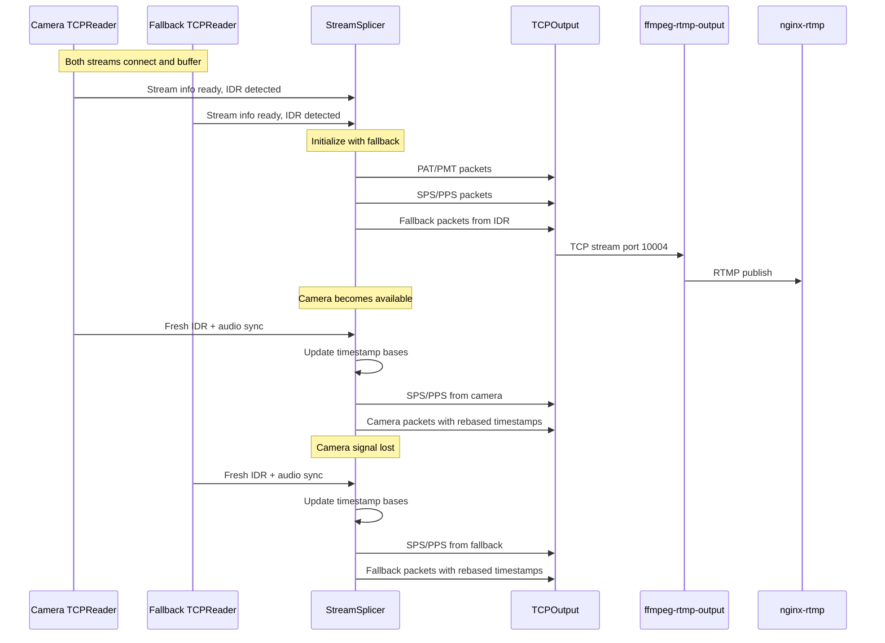

# Multiplexer Refactoring Plan

## Overview

This document outlines the plan to refactor the current complex multiplexer into a streamlined implementation based on the working `multi2/src/tcp_main.cpp` TCP splicing approach.

## Goals

1. **Replace RTMP subprocess with TCP output** - Connect to FFmpeg listening on TCP port 10004
2. **Simplify to camera + fallback only** - Drop drone support and complex switching logic
3. **Use multi2's proven splice algorithm** - IDR-aligned switching with proper timestamp rebasing
4. **Reduce code complexity** - Single-purpose, maintainable components

## Architecture

### Current Architecture (Complex)



### New Architecture (Streamlined)



## Data Flow



## Component Details

### 1. ffmpeg-rtmp-output Docker Container

**Purpose**: Listen on TCP 10004, receive MPEG-TS, publish to RTMP

**Dockerfile**: `docker/Dockerfile.ffmpeg-rtmp-output`

**FFmpeg Command**:
```bash
ffmpeg -f mpegts \
    -i "tcp://0.0.0.0:10004?listen=1&recv_buffer_size=2097152" \
    -c copy \
    -f flv \
    rtmp://nginx-rtmp/live/stream
```

**TCP Buffer Settings** (matching ffmpeg-fallback):
- `recv_buffer_size=2097152` (2MB)
- No muxrate for input (receiving)

### 2. TCPReader Class (from multi2)

**File**: `src/TCPReader.h` and `src/TCPReader.cpp`

**Key features from multi2**:
- Background thread for continuous buffering
- PAT/PMT discovery via TSDuck SectionDemux
- IDR frame detection in video PES
- Audio sync point detection (first audio PUSI after IDR)
- Rolling buffer with trim logic
- TSStreamReassembler for packet boundaries
- Infinite reconnection on disconnect

**Interface**:
```cpp
class TCPReader {
public:
    TCPReader(const std::string& tcpUrl, const std::string& name);
    ~TCPReader();
    
    bool connect();                     // Start background thread
    void disconnect();                  // Stop and cleanup
    
    void waitForStreamInfo();           // Block until PAT/PMT discovered
    void waitForIDR();                  // Block until IDR detected
    void resetForNewLoop();             // Reset IDR/audio detection
    
    StreamInfo getStreamInfo() const;
    bool extractTimestampBases();       // Extract PTS/PCR bases
    
    std::vector<ts::TSPacket> getBufferedPacketsFromIDR();
    std::vector<ts::TSPacket> receivePackets(size_t maxPackets, int timeoutMs);
    
    void initConsumptionFromIndex(size_t index);
    size_t getLastSnapshotEnd() const;
    
    // Timestamp bases
    uint64_t getPTSBase() const;
    uint64_t getPCRBase() const;
    int64_t getPCRPTSAlignmentOffset() const;
    
    // SPS/PPS for splice injection
    std::vector<uint8_t> getSPSData() const;
    std::vector<uint8_t> getPPSData() const;
    
    bool isConnected() const;
    bool isStreamReady() const;
};
```

### 3. TCPOutput Class

**File**: `src/TCPOutput.h` and `src/TCPOutput.cpp`

**Purpose**: Connect to FFmpeg TCP server and write TS packets

**Key features**:
- TCP client (connects to FFmpeg server listening on 10004)
- 2MB send buffer (matching ffmpeg-fallback's `TCP_SEND_BUFFER_SIZE`)
- TCP_NODELAY for reduced latency
- Automatic reconnection
- Packet counter statistics

**Interface**:
```cpp
class TCPOutput {
public:
    TCPOutput(const std::string& host, uint16_t port);
    ~TCPOutput();
    
    bool connect();                     // Connect to FFmpeg TCP server
    void disconnect();                  // Close connection
    
    bool writePacket(const ts::TSPacket& packet);
    bool writePackets(const std::vector<ts::TSPacket>& packets);
    
    bool isConnected() const;
    uint64_t getPacketsWritten() const;
};
```

### 4. StreamSplicer Class

**File**: `src/StreamSplicer.h` and `src/StreamSplicer.cpp`

**Purpose**: Handle clean splicing between camera and fallback streams

**Key features from multi2**:
- Global timestamp offsets (PTS, PCR)
- Timestamp rebasing using relative calculation
- Continuity counter management
- PAT/PMT generation with TSDuck
- SPS/PPS injection at splice points

**Interface**:
```cpp
class StreamSplicer {
public:
    StreamSplicer();
    
    // Initialize with fallback stream info
    void initialize(const StreamInfo& fallbackInfo);
    
    // Process and output a packet
    void processPacket(ts::TSPacket& packet, 
                       uint64_t ptsBase, uint64_t pcrBase,
                       int64_t pcrPtsAlignment);
    
    // Create PAT/PMT packets
    std::vector<ts::TSPacket> createPATPackets();
    std::vector<ts::TSPacket> createPMTPackets();
    
    // Create SPS/PPS injection packets
    std::vector<ts::TSPacket> createSPSPPSPackets(
        const std::vector<uint8_t>& sps,
        const std::vector<uint8_t>& pps,
        uint64_t pts);
    
    // Update offsets after segment
    void updateOffsets(uint64_t maxPTS, uint64_t maxPCR);
    
    // Get current offsets
    uint64_t getGlobalPTSOffset() const;
    uint64_t getGlobalPCROffset() const;
};
```

### 5. Main Program Logic

**File**: `src/main.cpp` (simplified)

**Algorithm** (based on multi2):

```
1. Initialize
   - Create TCPReader for camera (port 10000)
   - Create TCPReader for fallback (port 10001)
   - Create TCPOutput (connect to port 10004)
   - Create StreamSplicer
   
2. Wait for fallback stream
   - waitForStreamInfo() on fallback
   - waitForIDR() on fallback
   - extractTimestampBases() on fallback
   - Initialize splicer with fallback info
   
3. Output initial PAT/PMT + SPS/PPS + fallback packets
   
4. Main loop
   - If in FALLBACK mode:
     - Receive fallback packets, process and output
     - Check if camera is connected and has IDR ready
     - If camera ready → switch to CAMERA mode
     
   - If in CAMERA mode:
     - Receive camera packets, process and output
     - If camera timeout/disconnect → switch to FALLBACK mode
     
5. On switch:
   - Reset target stream for fresh IDR
   - Wait for IDR + audio sync
   - Re-extract timestamp bases
   - Inject SPS/PPS
   - Update splicer bases
   - Process buffered packets from IDR
```

## File Changes

### New Files to Create

| File | Description |
|------|-------------|
| `docker/Dockerfile.ffmpeg-rtmp-output` | FFmpeg container listening on TCP 10004 |
| `docker/ffmpeg-rtmp-output-wrapper.sh` | Wrapper script with signal handling |
| `docker/ffmpeg-rtmp-output-health-check.sh` | Health check script |
| `src/TCPReader.h` | Header for simplified TCP reader |
| `src/TCPReader.cpp` | Implementation based on multi2 |
| `src/TCPOutput.h` | Header for TCP output |
| `src/TCPOutput.cpp` | TCP client to FFmpeg |
| `src/StreamSplicer.h` | Header for splice logic |
| `src/StreamSplicer.cpp` | Clean splice implementation |

### Files to Modify

| File | Changes |
|------|---------|
| `src/main.cpp` | Complete rewrite - simplified main loop |
| `docker-compose.yml` | Add ffmpeg-rtmp-output service, update multiplexer |
| `CMakeLists.txt` | Update source file list |
| `config.yaml` | Simplify configuration |

### Files to Remove (or archive)

| File | Reason |
|------|--------|
| `src/Multiplexer.cpp/h` | Replaced by simplified main.cpp |
| `src/RTMPOutput.cpp/h` | Replaced by TCPOutput |
| `src/StreamSwitcher.cpp/h` | Logic moved to main.cpp |
| `src/TCPReceiver.cpp/h` | Replaced by TCPReader |
| `src/TSPacketQueue.cpp/h` | Not needed with new design |
| `src/TimestampManager.cpp/h` | Logic in StreamSplicer |
| `src/PIDMapper.cpp/h` | Logic in StreamSplicer |
| `src/InputSourceManager.cpp/h` | Removed - camera+fallback only |
| `src/HttpClient.cpp/h` | Removed - no controller integration |
| `src/HttpServer.cpp/h` | Removed - no HTTP API |
| `src/TSAnalyzer.cpp/h` | Logic in TCPReader |
| `src/NALParser.cpp/h` | Logic in TCPReader |
| `src/SPSPPSInjector.cpp/h` | Logic in StreamSplicer |
| `src/OutputTimestampMonitor.cpp/h` | Removed - simplification |

## TCP Buffer Configuration

From `ffmpeg-fallback-wrapper.sh`:
```bash
TCP_SEND_BUFFER_SIZE=${TCP_SEND_BUFFER_SIZE:-2097152}  # 2MB
MPEGTS_MAX_DELAY=${MPEGTS_MAX_DELAY:-1000000}          # 1 second
```

Apply same settings to:
1. **TCPOutput send buffer**: 2MB via `setsockopt(SO_SNDBUF)`
2. **ffmpeg-rtmp-output receive buffer**: 2MB in FFmpeg URL
3. **TCPReader receive buffer**: 2MB (already in current code)

## Testing Plan

1. **Unit test**: TCPOutput connects and writes packets
2. **Integration test**: Full pipeline camera → multiplexer → ffmpeg-rtmp-output → nginx-rtmp
3. **Splice test**: Fallback → Camera transition (kill camera, restart)
4. **Splice test**: Camera → Fallback transition (disconnect camera)
5. **Stress test**: Multiple rapid transitions

## Migration Steps

1. Create ffmpeg-rtmp-output container first (can test independently)
2. Create new source files alongside existing code
3. Create new main.cpp as `main_new.cpp` for parallel testing
4. Test new implementation with existing containers
5. Once stable, swap in new main.cpp
6. Remove deprecated files
7. Update documentation