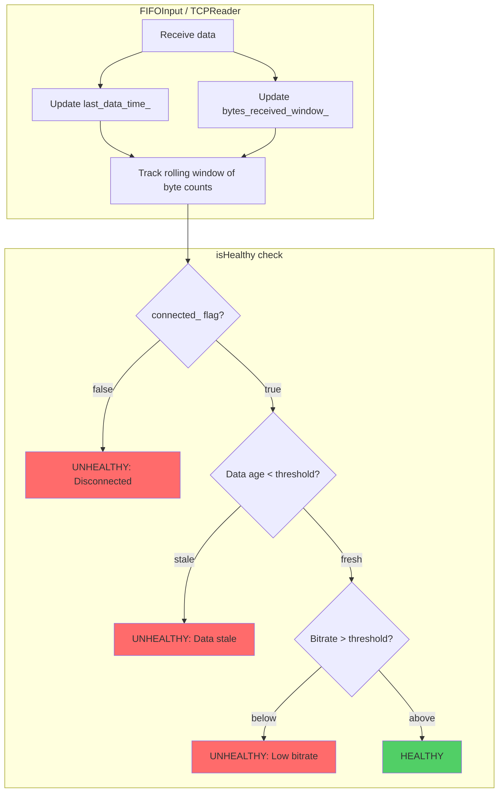

# Stream Health Monitoring Implementation Plan

## Problem Statement

The current multiplexer uses named pipes (FIFOs) for input streams from camera, drone, and fallback sources. The existing connection detection mechanism relies solely on:

1. **EOF detection** - `read()` returning 0 when all writers close the pipe
2. **Stream ready flags** - `pids_ready_` and `idr_ready_` atomic flags

This approach fails in several real-world scenarios:

- **Named pipe behavior**: EOF only occurs when ALL writers close; container termination may not cleanly close the write end
- **RTMP/SRT staying connected without data**: Input connections can remain "alive" while data stops flowing
- **Gradual degradation**: Bitrate can drop below usable levels without full disconnection

## Solution: Enhanced Stream Health Monitoring

Implement a unified health monitoring system that tracks:

1. **Data freshness** - Time since last packet received
2. **Bitrate monitoring** - Rolling average of bytes per second
3. **Combined health score** - Both thresholds must be met for "healthy" status



## Design: StreamHealthMetrics Structure

Add a new structure to encapsulate health metrics:

```cpp
// In a new file: src/StreamHealthMetrics.h

#pragma once
#include <chrono>
#include <atomic>
#include <deque>
#include <mutex>

/**
 * Configuration for stream health thresholds
 */
struct StreamHealthConfig {
    // Maximum time without data before considering stream unhealthy (ms)
    int64_t max_data_age_ms = 3000;
    
    // Minimum bitrate required for healthy stream (bytes per second)
    // 0 = disabled (data age only)
    uint64_t min_bitrate_bps = 0;
    
    // Window size for bitrate calculation (seconds)
    int bitrate_window_seconds = 3;
};

/**
 * Tracks stream health metrics for an input source.
 * Thread-safe for concurrent read/write access.
 */
class StreamHealthMetrics {
public:
    StreamHealthMetrics() = default;
    
    // Configure thresholds (call once at setup)
    void configure(const StreamHealthConfig& config) {
        config_ = config;
    }
    
    // Called when data is received
    void recordDataReceived(size_t bytes) {
        auto now = std::chrono::steady_clock::now();
        last_data_time_.store(now);
        total_bytes_received_.fetch_add(bytes);
        
        // Record in rolling window for bitrate calculation
        std::lock_guard<std::mutex> lock(window_mutex_);
        data_window_.push_back({now, bytes});
        
        // Trim old entries outside the window
        auto cutoff = now - std::chrono::seconds(config_.bitrate_window_seconds);
        while (!data_window_.empty() && data_window_.front().time < cutoff) {
            data_window_.pop_front();
        }
    }
    
    // Get time since last data in milliseconds
    int64_t getMsSinceLastData() const {
        auto last = last_data_time_.load();
        if (last == std::chrono::steady_clock::time_point{}) {
            return -1;  // No data received yet
        }
        auto now = std::chrono::steady_clock::now();
        return std::chrono::duration_cast<std::chrono::milliseconds>(now - last).count();
    }
    
    // Get current bitrate in bytes per second (rolling average)
    uint64_t getCurrentBitrateBps() const {
        std::lock_guard<std::mutex> lock(window_mutex_);
        
        if (data_window_.empty()) {
            return 0;
        }
        
        auto now = std::chrono::steady_clock::now();
        auto window_start = now - std::chrono::seconds(config_.bitrate_window_seconds);
        
        uint64_t total_bytes = 0;
        for (const auto& entry : data_window_) {
            if (entry.time >= window_start) {
                total_bytes += entry.bytes;
            }
        }
        
        return total_bytes / config_.bitrate_window_seconds;
    }
    
    // Check if data is fresh (within max_data_age_ms)
    bool isDataFresh() const {
        int64_t age = getMsSinceLastData();
        if (age < 0) return false;  // No data yet
        return age < config_.max_data_age_ms;
    }
    
    // Check if bitrate meets minimum threshold
    bool isBitrateHealthy() const {
        if (config_.min_bitrate_bps == 0) {
            return true;  // Bitrate check disabled
        }
        return getCurrentBitrateBps() >= config_.min_bitrate_bps;
    }
    
    // Combined health check
    bool isHealthy() const {
        return isDataFresh() && isBitrateHealthy();
    }
    
    // Get total bytes received
    uint64_t getTotalBytesReceived() const {
        return total_bytes_received_.load();
    }
    
    // Reset all metrics (for reconnection scenarios)
    void reset() {
        last_data_time_.store({});
        total_bytes_received_.store(0);
        std::lock_guard<std::mutex> lock(window_mutex_);
        data_window_.clear();
    }
    
private:
    struct DataPoint {
        std::chrono::steady_clock::time_point time;
        size_t bytes;
    };
    
    StreamHealthConfig config_;
    std::atomic<std::chrono::steady_clock::time_point> last_data_time_{};
    std::atomic<uint64_t> total_bytes_received_{0};
    
    mutable std::mutex window_mutex_;
    std::deque<DataPoint> data_window_;
};
```

## Integration Points

### 1. Modify FIFOInput.h / FIFOInput.cpp

Add health metrics as a member:

```cpp
// In FIFOInput.h
#include "StreamHealthMetrics.h"

class FIFOInput {
public:
    // ... existing methods ...
    
    // NEW: Health checking methods
    bool isHealthy() const { 
        return connected_.load() && health_metrics_.isHealthy(); 
    }
    
    bool isDataFresh(int64_t maxAgeMs = 0) const {
        if (maxAgeMs > 0) {
            return health_metrics_.getMsSinceLastData() < maxAgeMs;
        }
        return health_metrics_.isDataFresh();
    }
    
    int64_t getMsSinceLastData() const { 
        return health_metrics_.getMsSinceLastData(); 
    }
    
    uint64_t getCurrentBitrateBps() const { 
        return health_metrics_.getCurrentBitrateBps(); 
    }
    
    void configureHealthThresholds(const StreamHealthConfig& config) {
        health_metrics_.configure(config);
    }
    
private:
    StreamHealthMetrics health_metrics_;
};
```

Update `processFIFOStream()` to record data:

```cpp
// In FIFOInput.cpp - processFIFOStream()
ssize_t n = read(fd_, fifo_buffer, sizeof(fifo_buffer));

if (n > 0) {
    // NEW: Record health metrics
    health_metrics_.recordDataReceived(n);
    
    // ... existing processing ...
}
```

### 2. Same changes for TCPReader

Apply identical changes to `TCPReader.h` and `TCPReader.cpp` for consistency.

### 3. Modify main_new.cpp

Update the switching logic to use the new health checks:

```cpp
// For drone mode - detecting unhealthy stream
} else if (current_mode == Mode::DRONE) {
    // Check if privacy mode OR drone unhealthy
    bool drone_unhealthy = !drone_reader.isConnected() || 
                           !drone_reader.isStreamReady() ||
                           !drone_reader.isHealthy();  // NEW
    
    if (g_privacy_mode_enabled.load() || drone_unhealthy) {
        if (g_privacy_mode_enabled.load()) {
            std::cout << "[Main] Privacy mode enabled - switching to fallback!" << std::endl;
        } else if (!drone_reader.isDataFresh()) {
            std::cout << "[Main] Drone data stale (" 
                      << drone_reader.getMsSinceLastData() 
                      << "ms since last data) - switching to fallback!" << std::endl;
        } else if (!drone_reader.isBitrateHealthy()) {
            std::cout << "[Main] Drone bitrate too low ("
                      << drone_reader.getCurrentBitrateBps()
                      << " bps) - switching to fallback!" << std::endl;
        } else {
            std::cout << "[Main] Drone lost - switching to fallback!" << std::endl;
        }
        // ... switch to fallback ...
    }
}
```

### 4. Add Configuration to config.yaml

```yaml
# =============================================================================
# Stream Health Monitoring
# =============================================================================

# Maximum time without receiving data before considering stream unhealthy (ms)
# Applies to camera, drone, and fallback inputs
# Env var: MAX_DATA_AGE_MS (default: 3000)
max_data_age_ms: 3000

# Minimum bitrate threshold for healthy stream (bytes per second)
# Set to 0 to disable bitrate checking (only check data age)
# Recommended: 50000 (50KB/s) for low-bandwidth, 100000 (100KB/s) for HD
# Env var: MIN_BITRATE_BPS (default: 0)
min_bitrate_bps: 0

# Window size for bitrate calculation in seconds
# Larger window = smoother but slower to detect drops
# Env var: BITRATE_WINDOW_SECONDS (default: 3)
bitrate_window_seconds: 3
```

## Configuration Loading

Add a helper to load config (could use yaml-cpp or environment variables):

```cpp
// In main_new.cpp or a config utility

StreamHealthConfig loadHealthConfig() {
    StreamHealthConfig config;
    
    // Check environment variables (higher priority)
    if (const char* env = std::getenv("MAX_DATA_AGE_MS")) {
        config.max_data_age_ms = std::stoll(env);
    }
    if (const char* env = std::getenv("MIN_BITRATE_BPS")) {
        config.min_bitrate_bps = std::stoull(env);
    }
    if (const char* env = std::getenv("BITRATE_WINDOW_SECONDS")) {
        config.bitrate_window_seconds = std::stoi(env);
    }
    
    // Could also load from config.yaml here
    
    return config;
}

// In main()
StreamHealthConfig health_config = loadHealthConfig();
std::cout << "[Main] Health config: max_data_age=" << health_config.max_data_age_ms 
          << "ms, min_bitrate=" << health_config.min_bitrate_bps << " bps" << std::endl;

camera_reader.configureHealthThresholds(health_config);
drone_reader.configureHealthThresholds(health_config);
fallback_reader.configureHealthThresholds(health_config);
```

## Exposing Health Metrics via HTTP API

Enhance the `/health` endpoint to include input stream health:

```cpp
// In HttpServer.cpp - handleRequest for GET /health

// Add input health to response
{
    "healthy": true,
    "rtmp_connected": true,
    "packets_written": 12345,
    "ms_since_last_write": 50,
    "inputs": {
        "camera": {
            "connected": true,
            "stream_ready": true,
            "ms_since_last_data": 45,
            "bitrate_bps": 250000,
            "healthy": true
        },
        "drone": {
            "connected": false,
            "stream_ready": false,
            "ms_since_last_data": -1,
            "bitrate_bps": 0,
            "healthy": false
        },
        "fallback": {
            "connected": true,
            "stream_ready": true,
            "ms_since_last_data": 23,
            "bitrate_bps": 300000,
            "healthy": true
        }
    }
}
```

## Edge Cases and Failure Scenarios

| Scenario | Current Behavior | New Behavior |
|----------|------------------|--------------|
| Container killed abruptly | May hang waiting for EOF | Switches after `max_data_age_ms` timeout |
| Network packet loss causing stall | Stays on unhealthy stream | Switches after data age exceeds threshold |
| Bitrate degradation (poor connection) | Continues with choppy stream | Switches when bitrate drops below threshold |
| Brief network hiccup (<3s) | N/A | Tolerates brief gaps, doesn't switch |
| RTMP connection stays open without data | Hangs indefinitely | Switches after `max_data_age_ms` |
| SRT connection timeout | Depends on SRT settings | Switches after `max_data_age_ms` (faster) |

## Implementation Order

1. **Create `StreamHealthMetrics.h`** - New utility class
2. **Modify `FIFOInput.h/cpp`** - Add health metrics integration
3. **Modify `TCPReader.h/cpp`** - Same changes for TCP inputs (if still used)
4. **Update `config.yaml`** - Add new configuration options
5. **Modify `main_new.cpp`** - Use `isHealthy()` in switching logic
6. **Enhance `HttpServer.cpp`** - Expose health metrics via API
7. **Test all scenarios** - Container stops, network issues, bitrate drops

## Summary

This implementation provides:

- **Configurable thresholds** via environment variables or config.yaml
- **Dual health checks** - both data age and bitrate (bitrate optional)
- **Consistent API** across FIFOInput and TCPReader
- **Observable metrics** via HTTP health endpoint
- **Backward compatible** - existing code continues to work, just add health checks

The key insight is that "connected" in the FIFO/pipe sense doesn't mean "healthy" in the streaming sense. This plan separates those concerns and provides explicit health checking based on actual data flow.
