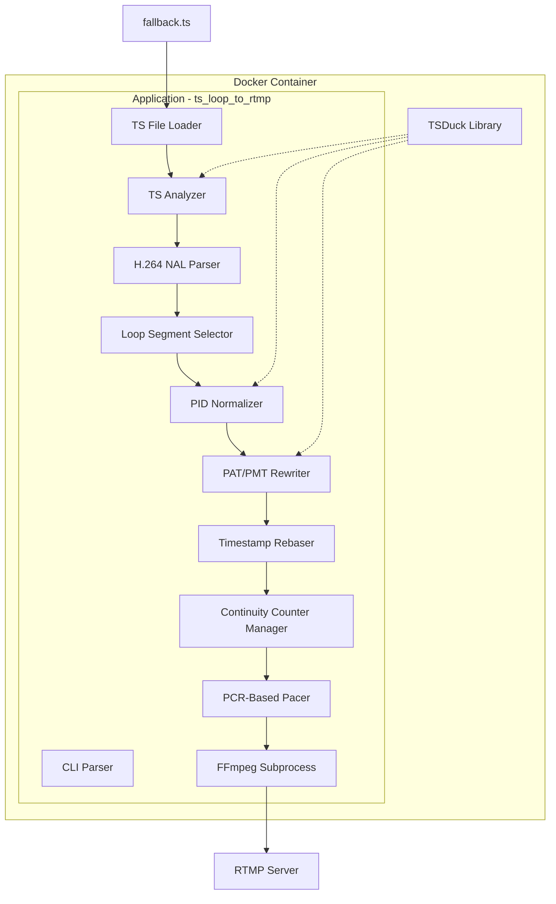
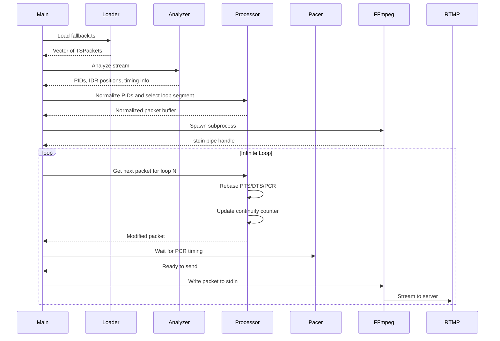

# TS Loop to RTMP - Architecture Document

## Overview

This document describes the architecture for `ts_loop_to_rtmp`, a C++ program that uses the TSDuck library to seamlessly splice MPEG-TS files and output to stdout or stream to an RTMP server. The program also includes `ts_tcp_splicer` for capturing and splicing live MPEG-TS streams over TCP.

## System Architecture



## Data Flow



## Component Details

### 1. Docker Infrastructure

**Purpose**: Provide a reproducible build environment with TSDuck pre-compiled.

**Files**:
- `Dockerfile` - Multi-stage build with TSDuck compilation
- `docker-compose.yml` - Volume mounting for build cache
- `.dockerignore` - Exclude unnecessary files

**Volume Strategy**:
```
Host: ./docker-cache/tsduck-build → Container: /opt/tsduck-build
Host: ./docker-cache/ccache → Container: /root/.ccache
Host: . → Container: /app (source code)
```

### 2. TS File Loader Module

**Purpose**: Read entire TS file into memory as a vector of packets.

**Key Functions**:
```cpp
class TSFileLoader {
    std::vector<ts::TSPacket> loadFile(const std::string& path);
    size_t getPacketCount() const;
    size_t getFileSize() const;
};
```

**Error Handling**:
- File not found
- Invalid TS packet sync bytes
- Partial packets at end of file

### 3. TS Analyzer Module

**Purpose**: Detect stream structure from PAT/PMT tables.

**Key Functions**:
```cpp
struct StreamInfo {
    ts::PID videoPID;
    ts::PID audioPID;
    ts::PID pcrPID;
    uint16_t programNumber;
    ts::PID pmtPID;
    uint8_t videoStreamType;
    uint8_t audioStreamType;
};

class TSAnalyzer {
    StreamInfo analyze(const std::vector<ts::TSPacket>& packets);
};
```

**Detection Strategy**:
1. Parse PAT to find PMT PID
2. Parse PMT to find video/audio PIDs and stream types
3. Identify PCR PID from PMT

### 4. H.264 NAL Unit Parser

**Purpose**: Find IDR frame positions for clean splice points.

**Key Functions**:
```cpp
struct IDRPosition {
    size_t packetIndex;      // Index in packet vector
    uint64_t pts;            // PTS at this IDR
    uint64_t pcr;            // PCR at or before this IDR
};

class NALParser {
    std::vector<IDRPosition> findIDRFrames(
        const std::vector<ts::TSPacket>& packets,
        ts::PID videoPID
    );
};
```

**NAL Detection**:
- Look for NAL unit type 5 (IDR slice)
- Track PES packet boundaries
- Handle NAL units split across packets

### 5. PID Normalizer Module

**Purpose**: Remap PIDs to fixed values.

**Configuration**:
```cpp
constexpr ts::PID NORMALIZED_VIDEO_PID = 256;
constexpr ts::PID NORMALIZED_AUDIO_PID = 257;
constexpr ts::PID NORMALIZED_PCR_PID = 256;  // Same as video
constexpr ts::PID NORMALIZED_PMT_PID = 4096;
```

**Key Functions**:
```cpp
class PIDNormalizer {
    void normalize(
        std::vector<ts::TSPacket>& packets,
        const StreamInfo& original,
        const NormalizedPIDs& target
    );
};
```

### 6. PAT/PMT Rewriter

**Purpose**: Update PSI tables to reflect normalized PIDs.

**Key Functions**:
```cpp
class PATRewriter {
    ts::TSPacket createPAT(uint16_t programNumber, ts::PID pmtPID);
};

class PMTRewriter {
    ts::TSPacket createPMT(
        uint16_t programNumber,
        ts::PID pcrPID,
        ts::PID videoPID,
        ts::PID audioPID,
        uint8_t videoStreamType,
        uint8_t audioStreamType
    );
};
```

### 7. Loop Segment Selector

**Purpose**: Determine the exact packet range for clean looping.

**Strategy**:
```
Loop structure to avoid orphaned continuation packets:
1. Send PAT packet
2. Send PMT packet
3. Stream from first IDR frame to end (skip orphaned packets between PAT/PMT and IDR)

Timeline:
[PAT][PMT][Orphaned Video][Null Padding][IDR-1][...frames...][IDR-N][...]
 ^1   ^2   ^--- SKIP --->                ^3 Start streaming   ^--- End (exclusive)
```

**Problem Solved**:
Between PAT/PMT and the first IDR frame, there may be orphaned video continuation packets
(PUSI=0) from a previous frame. These cause "Packet corrupt" errors in FFmpeg because they
lack proper PES headers. By sending PAT+PMT separately and then jumping to the first IDR,
we ensure a clean stream start with complete frames.

**Key Functions**:
```cpp
struct LoopSegment {
    size_t startPacketIndex;      // Overall start (PAT position)
    size_t endPacketIndex;        // Exclusive
    size_t patPacketIndex;        // Position of PAT packet
    size_t pmtPacketIndex;        // Position of PMT packet
    size_t idrStartIndex;         // Position of first IDR frame (actual video start)
    uint64_t ptsStart;
    uint64_t ptsEnd;
    uint64_t pcrStart;
    uint64_t pcrEnd;
    uint64_t durationPTS;         // ptsEnd - ptsStart
    uint64_t durationPCR;         // pcrEnd - pcrStart
};

class LoopSelector {
    LoopSegment selectSegment(
        const std::vector<ts::TSPacket>& packets,
        const std::vector<IDRPosition>& idrPositions
    );
    
private:
    size_t findPATBeforeIDR(const std::vector<ts::TSPacket>& packets, size_t idrPacketIndex);
    size_t findPMTAfterPAT(const std::vector<ts::TSPacket>& packets, size_t patPacketIndex, size_t maxIndex);
};
```

### 8. Timestamp Rebaser

**Purpose**: Maintain continuous PTS/DTS/PCR across loops.

**State**:
```cpp
struct TimestampState {
    uint64_t loopIndex = 0;
    uint64_t globalPTSOffset = 0;
    uint64_t globalDTSOffset = 0;
    uint64_t globalPCROffset = 0;
    uint64_t lastOutputPCR = 0;
    
    // Per-loop base values from original stream
    uint64_t loopPTSBase;
    uint64_t loopDTSBase;
    uint64_t loopPCRBase;
    uint64_t loopDurationPTS;
    uint64_t loopDurationPCR;
};
```

**Rebasing Formula**:
```cpp
new_pts = (original_pts - loopPTSBase) + globalPTSOffset
new_dts = (original_dts - loopDTSBase) + globalDTSOffset  
new_pcr = (original_pcr - loopPCRBase) + globalPCROffset

// After each loop:
globalPTSOffset += loopDurationPTS
globalDTSOffset += loopDurationPTS  // Usually same as PTS duration
globalPCROffset += loopDurationPCR
loopIndex++
```

### 9. Continuity Counter Manager

**Purpose**: Maintain valid continuity counters for all PIDs.

**Key Functions**:
```cpp
class ContinuityManager {
    std::map<ts::PID, uint8_t> counters;
    
    uint8_t getNextCounter(ts::PID pid);
    void updatePacket(ts::TSPacket& packet);
};
```

**Rules**:
- Counter increments for each packet with payload
- Counter stays same for adaptation-only packets
- Counter wraps from 15 to 0

### 10. PCR-Based Pacer

**Purpose**: Output packets at real-time rate based on PCR timing.

**Strategy**:
```cpp
class PCRPacer {
    std::chrono::steady_clock::time_point streamStartTime;
    uint64_t firstPCR;
    
    void waitForPCR(uint64_t targetPCR);
};

// PCR is in 27MHz units
// 1 second = 27,000,000 PCR ticks
void PCRPacer::waitForPCR(uint64_t targetPCR) {
    auto elapsed_pcr = targetPCR - firstPCR;
    auto elapsed_us = elapsed_pcr / 27;  // Convert to microseconds
    
    auto target_time = streamStartTime + std::chrono::microseconds(elapsed_us);
    std::this_thread::sleep_until(target_time);
}
```

### 11. FFmpeg Subprocess Manager

**Purpose**: Spawn and manage ffmpeg for RTMP output.

**Command**:
```bash
ffmpeg -f mpegts -i pipe:0 -c copy -f flv rtmp://localhost/live/stream
```

**Key Functions**:
```cpp
class FFmpegProcess {
    FILE* stdinPipe;
    pid_t pid;
    
    bool start(const std::string& rtmpUrl);
    bool writePacket(const ts::TSPacket& packet);
    void stop();
    bool isRunning();
};
```

**Note**: We do NOT use `-re` flag because we handle pacing ourselves via PCR.

## TCP Input Support

### 12. TCP Reader Module

**Purpose**: Connect to FFmpeg TCP server and receive live MPEG-TS stream, buffering until IDR frame is found.

**Key Features**:
- TCP client connects to FFmpeg server (listen mode)
- Reliable delivery (no packet loss)
- Continuous byte stream (simpler than UDP datagrams)
- Infinite reconnection on disconnect
- Rolling buffer (1500 packets ~3 seconds at 2Mbps)
- TSStreamReassembler handles TS packet boundaries in byte stream

**Implementation**:
```cpp
class TCPReader {
private:
    int sockfd;
    std::string host;
    int port;
    std::vector<ts::TSPacket> rollingBuffer;
    size_t maxBufferPackets = 1500;
    std::atomic<bool> connected;
    
public:
    TCPReader(const std::string& url, const std::string& name);
    bool connect();                      // Start background thread with connection retry
    void disconnect();                   // Stop and cleanup
    void waitForStreamInfo();           // Wait for PAT/PMT discovery
    void waitForIDR();                  // Wait for IDR frame detection
    std::vector<ts::TSPacket> receivePackets(size_t maxPackets, int timeoutMs);
};
```

**URL Format**:
- `tcp://127.0.0.1:9000` (connects to FFmpeg listening on port 9000)

**FFmpeg Server Command**:
```bash
ffmpeg -re -i input.ts -f mpegts tcp://127.0.0.1:9000?listen=1
```

**Error Handling**:
- Socket creation failure
- Connection failure (with retry)
- Connection reset/EOF (triggers reconnection)
- Background thread manages all reconnection logic
- No data timeout handling via condition variables

### TCP Splicer Operation

**Purpose**: Capture and splice live UDP MPEG-TS streams with support for both single-source and dual-source modes.

**Command Line Options**:
```bash
-duration N   # Duration in seconds to pull from each stream (required)
-loop N       # Number of times to loop (default: 1)
udp://...     # One or two UDP source URLs
```

**Operating Modes**:

#### Single Source Mode
When only one UDP URL is provided, the splicer operates in single-source mode:
- Captures `duration` seconds from the single UDP stream
- Repeats for `loop` iterations
- Total output: `duration × loop` seconds
- Maintains continuous timestamps across all segments

**Example**:
```bash
ts_udp_splicer -duration 10 -loop 3 udp://127.0.0.1:1234 > output.ts
```
Output: 30 seconds total (10s × 3 loops) from one stream

**Timing Model**:
```
PTS Timeline (90kHz ticks):
┌──────────────┬──────────────┬──────────────┐
│   Segment 1  │   Segment 2  │   Segment 3  │
│   (10 sec)   │   (10 sec)   │   (10 sec)   │
│ 0→900k ticks │ 900k→1.8M    │ 1.8M→2.7M    │
└──────────────┴──────────────┴──────────────┘
        Loop 1        Loop 2        Loop 3
```

#### Dual Source Mode
When two UDP URLs are provided, the splicer operates in dual-source mode:
- Alternates between the two UDP streams
- Each stream plays for `duration` seconds
- Repeats for `loop` iterations
- Total output: `duration × 2 × loop` seconds
- Seamless IDR-aligned switches between sources

**Example**:
```bash
ts_udp_splicer -duration 10 -loop 2 udp://127.0.0.1:1234 udp://127.0.0.1:1235 > output.ts
```
Output: 40 seconds total (10s stream1 + 10s stream2) × 2 loops

**Timing Model**:
```
PTS Timeline (90kHz ticks):
┌──────────────┬──────────────┬──────────────┬──────────────┐
│   Stream 1   │   Stream 2   │   Stream 1   │   Stream 2   │
│   (10 sec)   │   (10 sec)   │   (10 sec)   │   (10 sec)   │
│ 0→900k ticks │ 900k→1.8M    │ 1.8M→2.7M    │ 2.7M→3.6M    │
└──────────────┴──────────────┴──────────────┴──────────────┘
            Loop 1 (-loop 2)              Loop 2
```

**Splice Algorithm** (applies to both modes):
1. Connect to UDP stream(s) and start background buffering
2. Wait for PAT/PMT discovery on all streams
3. Wait for IDR frame detection on all streams
4. Extract timestamp bases and SPS/PPS from initial buffered packets
5. Write PAT/PMT to output
6. For each loop iteration:
   - For each stream (1 in single-source, 2 in dual-source):
     a. Inject SPS/PPS at splice point
     b. Process buffered packets from IDR frame
     c. Consume live packets until `duration` seconds elapsed (PTS-based)
     d. Update global timestamp offsets for next segment
7. Maintain continuous timestamps across all segments

**Splice Point Guarantees**:
- All streams start at IDR frames
- SPS/PPS injected before each segment
- Timestamps continuously rebased using relative calculation
- Continuity counters maintained globally
- No decoder discontinuities
- Single-consumer architecture prevents packet loss

**Requirements**:
- Stream(s) must have regular IDR frames (keyframes)
- For dual-source mode, both streams must be compatible:
  - Same resolution
  - Same codec (H.264/HEVC)
  - Same profile/level
  - Similar bitrate recommended for smooth playback
- Each stream is automatically analyzed for PAT/PMT/SPS/PPS

**Background Buffering Architecture**:
- Single background thread per UDP reader
- Self-discovers stream info (PAT/PMT parsing)
- Detects IDR frames automatically
- Maintains 3-second rolling buffer (~1500 packets)
- Efficient consumption via condition variables
- No packet loss due to single-consumer design

## File Structure

```
ts_loop_to_rtmp/
├── Dockerfile
├── docker-compose.yml
├── .dockerignore
├── CMakeLists.txt
├── README.md
├── ARCHITECTURE.md
├── src/
│   └── main.cpp           # All-in-one implementation
├── videos/
│   ├── fallback.ts
│   ├── inputa.ts
│   └── inputb.ts
└── scripts/
    └── test_stream.sh
```

## Logging and Statistics

### Custom Logger (Not TSDuck's logger)

**Purpose**: Provide consistent logging with quiet mode support.

**Implementation**:
```cpp
enum class LogLevel { DEBUG, INFO, WARN, ERROR };

class Logger {
    static bool quietMode;
    static LogLevel minLevel;
    
public:
    static void setQuietMode(bool quiet);
    static void debug(const std::string& msg);
    static void info(const std::string& msg);
    static void warn(const std::string& msg);
    static void error(const std::string& msg);
};

// Usage:
// --quiet flag: only ERROR messages are shown
// Default: all levels are shown (DEBUG, INFO, WARN, ERROR)
```

### Statistics Collector

**Purpose**: Track detailed metrics for debugging.

**Metrics to Track**:
```cpp
struct Statistics {
    // Packet counts
    uint64_t totalPacketsSent = 0;
    uint64_t videoPacketsSent = 0;
    uint64_t audioPacketsSent = 0;
    uint64_t patPacketsSent = 0;
    uint64_t pmtPacketsSent = 0;
    
    // Loop tracking
    uint64_t loopsCompleted = 0;
    std::chrono::steady_clock::time_point startTime;
    std::chrono::steady_clock::time_point lastLoopTime;
    
    // Timing stats
    uint64_t lastOutputPCR = 0;
    uint64_t lastOutputPTS = 0;
    double avgPacingDriftUs = 0.0;
    double maxPacingDriftUs = 0.0;
    
    // Timestamps at boundaries
    uint64_t lastLoopEndPTS = 0;
    uint64_t lastLoopEndPCR = 0;
    
    // Bytes written
    uint64_t totalBytesWritten = 0;
    
    void print() const;  // Print summary to stdout
    void printPeriodic();  // Print every N seconds if not quiet
};
```

**Periodic Output** (every 10 seconds when not in quiet mode):
```
[STATS] Loop #5 | Packets: 12500 | PCR: 2700000000 | PTS: 900000 | Drift: +0.3ms
```

## Error Handling Strategy

Each module should throw specific exception types:

```cpp
class TSLoopError : public std::runtime_error {
    using std::runtime_error::runtime_error;
};

class FileLoadError : public TSLoopError { ... };
class AnalysisError : public TSLoopError { ... };
class ProcessError : public TSLoopError { ... };
class TimestampError : public TSLoopError { ... };
```

Main function catches and reports errors with clear messages:

```cpp
int main(int argc, char* argv[]) {
    try {
        // ... run application
    } catch (const FileLoadError& e) {
        std::cerr << "Failed to load TS file: " << e.what() << std::endl;
        return 1;
    } catch (const AnalysisError& e) {
        std::cerr << "Stream analysis failed: " << e.what() << std::endl;
        return 2;
    } // ... etc
}
```

## Build Configuration

### CMakeLists.txt Key Settings

```cmake
cmake_minimum_required(VERSION 3.16)
project(ts_loop_to_rtmp VERSION 1.0.0 LANGUAGES CXX)

set(CMAKE_CXX_STANDARD 17)
set(CMAKE_CXX_STANDARD_REQUIRED ON)

# Find TSDuck
find_package(PkgConfig REQUIRED)
pkg_check_modules(TSDUCK REQUIRED tsduck)

# Executable
add_executable(ts_loop_to_rtmp
    src/main.cpp
    src/ts_file_loader.cpp
    # ... all other source files
)

target_include_directories(ts_loop_to_rtmp PRIVATE 
    ${TSDUCK_INCLUDE_DIRS}
)

target_link_libraries(ts_loop_to_rtmp PRIVATE
    ${TSDUCK_LIBRARIES}
    pthread
)
```

## Testing Strategy

1. **Generate test content**:
   ```bash
   ./generate_fallback.sh -d 10 -p smptebars
   ./convert_fallback.sh
   ```

2. **Start RTMP server** (nginx-rtmp or similar):
   ```bash
   docker run -p 1935:1935 tiangolo/nginx-rtmp
   ```

3. **Run the looper**:
   ```bash
   ./ts_loop_to_rtmp --input videos/fallback.ts --rtmp-url rtmp://localhost/live/stream
   ```

4. **Verify with VLC**:
   ```bash
   vlc rtmp://localhost/live/stream
   ```

5. **Check for issues**:
   - Watch for visual glitches at loop boundary
   - Monitor ffmpeg stderr for warnings
   - Use `tsanalyze` to verify output stream validity