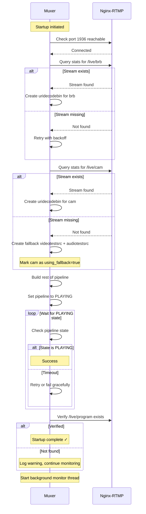
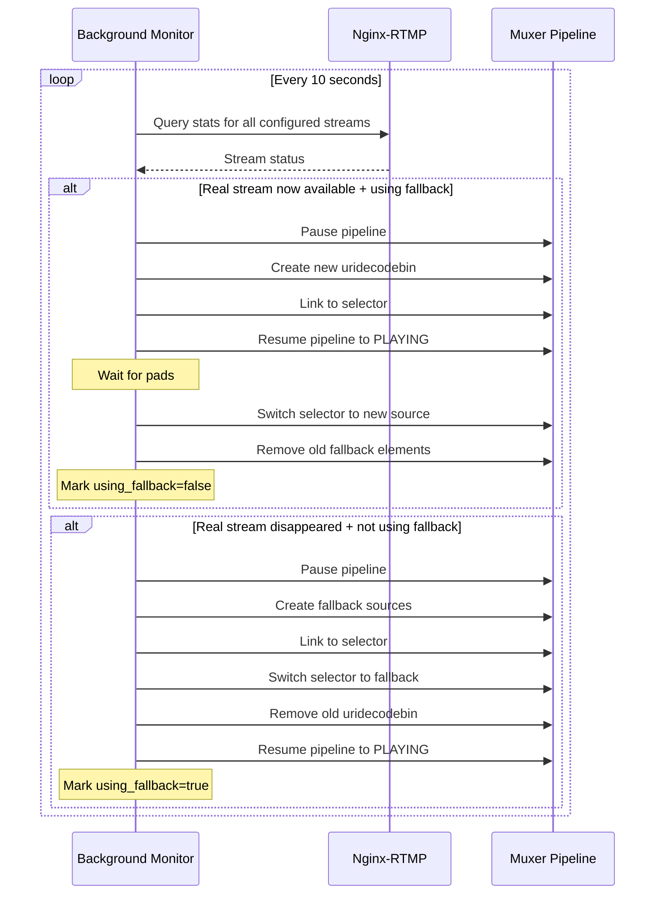

# Muxer Startup Race Condition Fix - Implementation Plan

## Problem Summary

The muxer fails to create the `/live/program` stream on initial startup when optional input streams (like `/live/cam`) don't exist yet. The GStreamer `uridecodebin` element waits indefinitely for streams to be available before emitting pads, causing the pipeline to get stuck in PAUSED state instead of reaching PLAYING state, which prevents the rtmpsink from publishing.

## Root Cause

1. `uridecodebin` for cam tries to connect to non-existent stream at startup
2. Element never emits pads because connection fails/blocks
3. Pipeline can't reach PLAYING state without all pads linked
4. rtmpsink only publishes when pipeline is in PLAYING state
5. Result: `/live/program` is never created

## Solution Architecture

### Phase 1: Stream Verification & Fallback Sources

**Objective:** Ensure pipeline always reaches PLAYING state by using test sources as fallbacks

**Implementation:**
- Add `check_stream_exists(stream_name)` function that queries nginx-rtmp stats XML
- Modify `make_input()` to check stream existence before creating uridecodebin
- For missing optional streams (cam), create fallback using:
  - `videotestsrc` pattern=black for video
  - `audiotestsrc` wave=silence for audio
- Mark sources with `using_fallback` flag for monitoring

**Benefits:**
- Pipeline always starts successfully
- Can detect which sources are real vs fallback
- System remains operational even with missing inputs

### Phase 2: Hot Reconnection System

**Objective:** Automatically replace fallback sources with real streams when they become available

**Implementation:**
- Background monitoring thread polls nginx stats every 10 seconds
- When real stream appears and fallback is active:
  1. Dynamically create new uridecodebin element
  2. Add to pipeline and link pads
  3. Switch selector to new source
  4. Remove old fallback elements
- Reverse process if real stream disappears (back to fallback)

**Technical Notes:**
- Use GStreamer dynamic pipeline modification
- Requires careful state management (PAUSED -> modify -> PLAYING)
- Must handle pad-added signals for new uridecodebin

### Phase 3: Enhanced Health Endpoint

**Objective:** Expose source availability for monitoring and dashboard

**Current `/health` response:**
```
HTTP 200: "ok\n"
```

**New `/health` response (JSON):**
```json
{
  "status": "healthy",
  "pipeline_state": "PLAYING",
  "sources": {
    "brb": {
      "available": true,
      "using_fallback": false,
      "stream_exists": true
    },
    "cam": {
      "available": true,
      "using_fallback": true,
      "stream_exists": false,
      "last_check": "2025-11-03T03:30:00Z"
    }
  },
  "output": {
    "stream": "/live/program",
    "publishing": true,
    "verified": true
  },
  "current_scene": "brb",
  "uptime_seconds": 3600
}
```

**Use Cases:**
- Dashboard can show warning when cam is on fallback
- Monitoring can alert if sources unavailable for too long
- Healthcheck passes as long as pipeline is PLAYING

### Phase 4: Dashboard Integration

**Backend Changes (`rtmpParser.js`):**
- Fetch enhanced `/health` endpoint from muxer
- Parse source availability status
- Include in aggregated data sent to frontend

**Frontend Changes (`StreamStats.vue`):**
- Add visual indicator for fallback sources (warning icon)
- Display different colors for real vs fallback streams
- Show tooltip: "Using test pattern - waiting for real stream"

### Phase 5: Output Verification

**Objective:** Ensure `/live/program` is actually publishing

**Implementation:**
- After pipeline reaches PLAYING, wait 2 seconds
- Query nginx stats to verify `/live/program` exists
- Log confirmation or warning
- Include verification status in health endpoint

## Detailed Flow Diagrams

### Startup Flow (New)



### Hot Reconnection Flow



## Implementation Checklist

### Muxer Changes (`rtmp_switcher.py`)

- [ ] Add `check_stream_exists(stream_name)` using nginx stats XML parsing
- [ ] Add `create_fallback_source(tag)` for videotestsrc + audiotestsrc
- [ ] Modify `make_input()` to check existence and use fallbacks
- [ ] Add `sources` dict tracking: `{available, using_fallback, last_check}`
- [ ] Add background monitoring thread with 10s interval
- [ ] Implement hot reconnection logic for dynamic pipeline modification
- [ ] Add pipeline state monitoring with explicit PLAYING confirmation
- [ ] Add output verification by checking `/live/program` in nginx stats
- [ ] Convert `/health` endpoint to return JSON with detailed status
- [ ] Add startup time tracking for uptime calculation
- [ ] Enhanced logging for all state transitions

### Dashboard Backend Changes

- [ ] Update `rtmpParser.js` to fetch JSON from `/health` endpoint
- [ ] Parse source availability and fallback status
- [ ] Include in aggregated data structure
- [ ] Handle backward compatibility if muxer not updated yet

### Dashboard Frontend Changes  

- [ ] Update `StreamStats.vue` to display source status
- [ ] Add warning icon/badge for fallback sources
- [ ] Add tooltip explaining fallback mode
- [ ] Color-code streams: green=real, yellow=fallback, red=unavailable
- [ ] Update CSS for new visual indicators

## Testing Plan

### Test 1: Cold Start Without Cam
1. Stop all containers
2. Start nginx-rtmp
3. Start ffmpeg-brb (only brb)
4. Start muxer
5. **Expected:** 
   - Muxer starts successfully
   - `/live/program` created immediately
   - Cam shows using_fallback=true in health
   - Dashboard shows warning on cam

### Test 2: Hot Reconnection
1. With setup from Test 1 running
2. Start ffmpeg-dev-cam
3. **Expected:**
   - Within 10 seconds, muxer detects real cam
   - Automatically replaces fallback with real stream
   - Cam shows using_fallback=false in health
   - Dashboard warning clears
   - No interruption to `/live/program` output

### Test 3: Stream Loss Recovery
1. With all running normally
2. Stop ffmpeg-dev-cam
3. **Expected:**
   - Within 10 seconds, muxer detects cam loss
   - Automatically falls back to test source
   - Cam shows using_fallback=true again
   - Dashboard shows warning again
   - No interruption to `/live/program` output

### Test 4: Total Restart
1. With muxer using fallback for cam
2. Stop muxer container
3. Restart muxer container
4. **Expected:**
   - Same as Test 1 (starts with fallback)
   - If cam already running, hot reconnection occurs

## Configuration Options

Add environment variables for tuning:

```bash
# Muxer environment variables
STREAM_CHECK_INTERVAL=10  # Seconds between stream availability checks
STREAM_CHECK_TIMEOUT=2    # Timeout for nginx stats queries
STARTUP_VERIFY_DELAY=2    # Seconds to wait before verifying output
MAX_STARTUP_RETRIES=5     # Max retries if pipeline fails to start
```

## Rollback Plan

If issues arise:
1. Revert `rtmp_switcher.py` to previous version
2. Container restart will restore old behavior
3. Dashboard changes are backward compatible (checks for JSON, falls back to text)
4. No data loss or permanent state changes

## Success Criteria

- ✅ Muxer starts successfully even when cam is unavailable
- ✅ `/live/program` stream created on first startup
- ✅ Automatic reconnection when streams become available
- ✅ Dashboard shows real-time source availability status
- ✅ No manual intervention required for container restarts
- ✅ System remains operational during input source changes
- ✅ Health endpoint provides actionable monitoring data