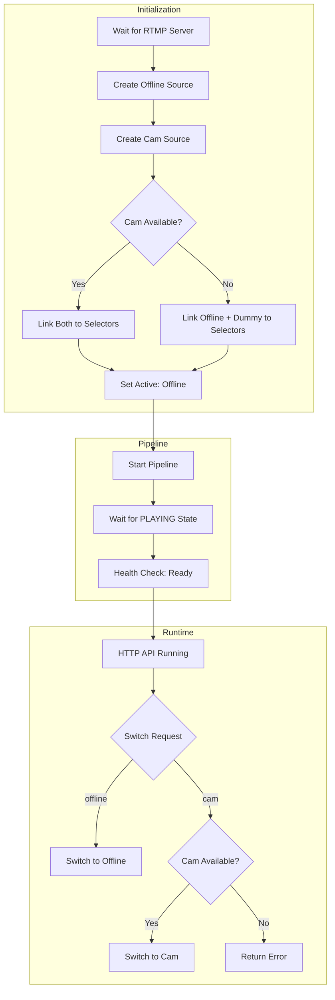

# Stream Switcher Refactoring Plan

## Problem Analysis

**Root Cause**: Current implementation uses lazy-loading, creating only the offline source initially. This breaks the input-selector pipeline configuration, preventing data flow to the RTMP sink.

**Working Version**: Creates both sources upfront, links them to selectors, then starts the pipeline.

## Proposed Hybrid Architecture

Combine the proven working approach with enhanced error handling and graceful degradation.

### Architecture Flow



### Key Design Decisions

#### 1. **Upfront Source Creation**
- Create both `offline` and `cam` sources during initialization
- Match working version's proven architecture
- Enables proper input-selector configuration

#### 2. **Graceful Degradation for Unavailable Streams**
Two options:

**Option A - Dummy Source (Recommended)**
```python
if cam_unavailable:
    # Create a dummy black video + silence audio source
    cam_source = create_dummy_source()
    # This ensures selector always has valid pads
```

**Option B - Offline Fallback**
```python
if cam_unavailable:
    # Use offline as fallback for cam pad
    link_to_selector(selector, offline_pads, "cam_fallback")
    # Note: switching to "cam" will show offline stream
```

#### 3. **Simplified Health Check**
```python
# OLD (complex, never returns healthy):
if pipeline_playing and stream_published:
    return 200
    
# NEW (simple, reliable):
if pipeline_playing:
    return 200
```

#### 4. **Enhanced Error Handling**
- Keep improved logging from current version
- Add clear error messages for source creation failures
- Log which sources are available at startup

#### 5. **Removed Complexity**
- No lazy-loading mechanism
- No stream availability polling during startup
- No nginx-rtmp stream verification (unreliable)

### Implementation Steps

1. **Refactor `Switcher.__init__`**
   - Remove lazy-loading logic (`_create_source`, `source_components`, etc.)
   - Create both sources upfront using `make_input` function
   - Add try-catch for cam source creation
   - Link both to selectors before starting pipeline

2. **Add Graceful Cam Handling**
   - Wrap cam source creation in try-except
   - If unavailable, create dummy source OR use offline as fallback
   - Track cam availability state for switch requests

3. **Simplify `set_source`**
   - Remove `_create_source` call
   - Check if requested source is available
   - Return helpful error if cam unavailable

4. **Update Health Check**
   - Remove `stream_published` dependency
   - Return 200 if `pipeline_playing == True`
   - Return 503 otherwise

5. **Clean Up Helper Functions**
   - Keep: `wait_for_rtmp_server` (useful)
   - Remove: `wait_for_stream`, `verify_stream_published`
   - Remove: `wait_for_playing_state`, `wait_for_stream_publication`

6. **Keep Good Logging**
   - Retain all the `[tag]` prefixed logging
   - Keep bus message handler improvements
   - Keep state change tracking

### Testing Plan

1. **Test with both streams available**
   - Verify pipeline starts and publishes
   - Test switching between offline and cam
   - Verify health check returns 200

2. **Test with cam unavailable**
   - Start without cam stream
   - Verify pipeline still starts with offline
   - Verify switching to cam returns error
   - Verify health check still returns 200

3. **Test error recovery**
   - Verify helpful error messages
   - Ensure no hangs or deadlocks
   - Confirm health check reliability

## Code Changes Summary

### Files to Modify
- `stream-switcher/rtmp_switcher.py` - Main refactoring

### Lines to Change
- Lines 137-501: Entire `Switcher` class
- Lines 505-530: Health check handler
- Lines 32-119: Remove or simplify helper functions

### Lines to Keep
- Lines 1-30: Imports and config (good as-is)
- Lines 121-135: Helper functions `make()` and `first_ok()`
- Lines 532-571: HTTP server and main execution (good as-is)

## Expected Outcome

After refactoring:
- ✅ Stream publishes to nginx-rtmp successfully
- ✅ Health check returns 200 when pipeline is running
- ✅ Graceful handling of unavailable cam stream
- ✅ Clear, maintainable code matching working version
- ✅ Enhanced logging for debugging
- ✅ Docker compose dependency chain works correctly